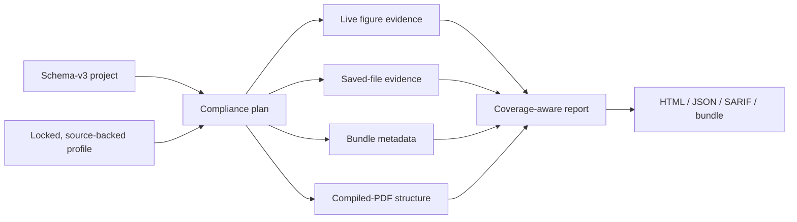

# ResearchPlot 2.0

**A local, source-backed preflight workspace for research figures.**

[](https://pypi.org/project/researchplot-venues/)
[](https://pypi.org/project/researchplot-venues/)
[](https://github.com/Devrajsinh-Jhala/ResearchPlot/actions/workflows/ci.yml)
[](https://devrajsinh-jhala.github.io/ResearchPlot/)
[](https://github.com/Devrajsinh-Jhala/ResearchPlot/blob/main/LICENSE)

[PyPI package](https://pypi.org/project/researchplot-venues/) ·
[documentation website](https://devrajsinh-jhala.github.io/ResearchPlot/) ·
[releases](https://github.com/Devrajsinh-Jhala/ResearchPlot/releases)

ResearchPlot checks the files that researchers actually submit. It resolves an
immutable venue profile, plans which evidence is needed, inspects live Matplotlib
figures and saved artifacts, and reports both violations **and gaps it could not
establish**. The project model also carries captions, descriptions, source data,
deliverables, manuscript metadata, and profile locks.

ResearchPlot is a compliance assistant, not an acceptance guarantee. Its sources,
caveats, coverage gaps, and skipped checks remain visible in every report.




## Install

ResearchPlot 2.0 requires Python 3.11 or newer. The distribution is named
`researchplot-venues`; the import package and command are both `researchplot`.

```bash
python -m pip install researchplot-venues
researchplot --version
```

Optional capabilities are installed only when needed:

```bash
python -m pip install "researchplot-venues[web]"       # local browser workspace
python -m pip install "researchplot-venues[registry]"  # signed profile sync
python -m pip install "researchplot-venues[plots]"     # deprecated plotting helpers
```

The base package works offline and requires neither LaTeX nor downloaded fonts.
Checking, exporting, bundling, and the browser workspace do not contact the network.

## Audit an existing figure first

Use a pinned profile coordinate for repeatable work:

```bash
researchplot audit figures/figure1.pdf \
  --profile nature@2026.08.0 \
  --role main \
  --width single \
  --content line-art
```

The same operation is available in Python:

```python
import researchplot as rp

target = rp.target(
    "nature@2026.08.0",
    role="main",
    width="single",
    content="line-art",
)
report = target.audit("figures/figure1.pdf")

print(report.verdict)
for finding in report.failures:
    print(finding.rule_id, finding.message)
```

A saved file cannot prove every property of the figure that produced it. Required
live-figure or bundle evidence that is unavailable makes a coverage-aware project
result `INDETERMINATE`; it is never silently counted as a pass.

## Create a strict v2 project

`researchplot.toml` uses schema version 3. Unknown keys, duplicate IDs, unpinned
profiles, invalid formats, unsafe/out-of-root paths, and empty projects are errors.

```toml
schema_version = 3
profile = "nature@2026.08.0"
policy = "complete"
lock = "researchplot.lock.json"

[[figures]]
id = "figure-1"
number = 1
role = "main"
width = "single"
content = "line-art"
caption = "Response increases across the four measured inputs."
alt_text = "Line chart with a monotonic increase from input zero to three."
source_data = ["data/figure1.csv"]

[[figures.deliverables]]
id = "main"
format = "pdf"
path = "figures/figure1.pdf"
required = true
preferred = true
```

Resolve and write the profile lock, then check in frozen mode:

```bash
researchplot profile lock nature@2026.08.0 --output researchplot.lock.json
researchplot check --config researchplot.toml --frozen
```

The Python workflow exposes the same plan and coverage model:

```python
import researchplot as rp

project = rp.Project.load("researchplot.toml")
plan = project.plan(frozen=True)
report = plan.check()

if report.verdict is rp.Verdict.COMPLIANT:
    bundle = project.bundle("dist/submission")
```

`Project.bundle()` currently writes a verified submission **directory**. Build a
deterministic ZIP from that directory with `create_deterministic_archive()` after its
manifest verifies. JATS and RO-Crate metadata converters are available for the emitted
submission manifest; they do not invent missing captions or descriptions.

## Make a Matplotlib figure at the venue width

```python
import matplotlib.pyplot as plt
import researchplot as rp

project = rp.Project.load("researchplot.toml")
figure = project.figure("figure-1")

with figure.style(deliverable="main") as style:
    fig, ax = style.subplots(aspect=0.62)
    ax.plot([0, 1, 2, 3], [0, 1, 4, 9], marker="o")
    ax.set(xlabel="Input", ylabel="Response")

    report = figure.check(fig=fig)
    result = figure.export(fig, policy="violations")

print(report.verdict, result.paths)
plt.close(fig)
```

The style uses `matplotlib.rc_context`; global rcParams are restored even after an
exception. ResearchPlot does not replace Matplotlib, Seaborn, SciencePlots, TUEPlots,
R, Julia, or design software. Any tool may create the saved artifact; only live styling
and live-artist inspection are Matplotlib-specific.

## Understand the verdict

| Verdict | Meaning |
| --- | --- |
| `COMPLIANT` | Every applicable encoded required rule has sufficient evidence and passes. |
| `NON_COMPLIANT` | At least one applicable required rule is known to fail. |
| `INDETERMINATE` | No required rule is known to fail, but required evidence or capability is missing. |

Rule strength and check status are independent. Recommendations warn; inferred
guidance is informational. A manual attestation can satisfy only a rule classified as
manual. A waiver records a workflow decision but does not turn a venue violation into
venue compliance.

CLI exit codes are stable: `0` compliant, `1` non-compliant, `2` invalid/unsafe input
or an operational capability error, and `3` indeterminate.

## What 2.0 can inspect

- PDF page boxes, physical size, font resources, embedded images, color spaces,
  transparency, annotations, JavaScript, actions, and embedded files.
- SVG dimensions, text/font declarations, embedded and external references, scripts,
  handlers, and `foreignObject` content.
- PNG, JPEG, and TIFF dimensions, EXIF orientation, DPI, color mode, ICC data, bit
  depth, compression, alpha, and frame count where exposed by the format.
- EPS format integrity and bounding boxes, with unsupported properties reported as
  unresolved.
- Deterministic grayscale and color-vision previews plus advisory contrast, entropy,
  transparency, rendered text/legend clipping, label-overlap, whitespace, final-size
  font, and colormap-luminance diagnostics.
- Compiled manuscript PDF structure and conservative figure placement through embedded
  provenance IDs, exact raster fingerprints, or unique configured hints. It measures
  bounds, rotation, scale/effective DPI, and crop-box clipping; vector fingerprinting,
  caption/reference reconciliation, and venue-rule integration remain unresolved.
- Submission manifests, path safety, hashes, deterministic ZIP archives, JATS figure
  metadata, and optional RO-Crate metadata.

Parsers are bounded and active content is reported, never executed. Isolated artifact
inspection is available for hostile or untrusted inputs, but no parser should be
treated as a perfect sandbox.

## Profiles and provenance

Profiles are declarative, immutable JSON data with coordinates such as
`cvpr-2026@2026.08.0`, SHA-256 digests, rule applicability, typed probes, official
source locators, verification dates, interpretation notes, review status, and caveats.
Missing official guidance stays unspecified.

```bash
researchplot profile list
researchplot profile search vision
researchplot profile show cvpr-2026@2026.08.0
researchplot explain figure.width.single --profile nature@2026.08.0
```

ResearchPlot 2.0 ships 22 bundled profiles spanning journals, publisher guidance, and
2026 CS/ML conferences. See the generated
[profile evidence catalog](https://devrajsinh-jhala.github.io/ResearchPlot/generated/profiles/)
for every rule and source. Generic publisher profiles are not presented as
journal-specific guarantees, and narrow profiles cover only the rules their official
sources establish.

Signed registry updates are opt-in. Only an explicit profile-sync operation may use
the network; normal resolution consults installed data and project locks prevent silent
updates or rollback. Registry clients require an explicitly configured trusted root.

## Local browser workspace

```bash
python -m pip install "researchplot-venues[web]"
researchplot serve
```

The workspace binds only to `127.0.0.1`, uses a per-launch token and origin checks,
and deletes uploaded temporary artifacts after inspection. It supports local
drag-and-drop artifact audits, installed-profile discovery, JSON export, reproducible
CLI commands, and raster grayscale/color-vision previews. It does not upload files,
send telemetry, edit scientific data, or update profiles.

## Compatibility and migration

The v1 `Target`, `target()`, reports, project reader, CLI aliases, and
`researchplot.plots` bridge remain available throughout 2.x with deprecation warnings.
Install `[plots]` only while migrating; new work should compose figures with native
Matplotlib. Run `researchplot migrate` to translate a v1 configuration into a separate
schema-v3 file and review every untranslatable field before adoption.

No compatibility surface is scheduled for removal before 3.0.

## Documentation

- [ResearchPlot 2.0 overview](https://devrajsinh-jhala.github.io/ResearchPlot/v2/)
- [Getting started](https://devrajsinh-jhala.github.io/ResearchPlot/getting-started/)
- [Compliance and coverage](https://devrajsinh-jhala.github.io/ResearchPlot/compliance/)
- [Configuration](https://devrajsinh-jhala.github.io/ResearchPlot/configuration/)
- [Artifact and bundle formats](https://devrajsinh-jhala.github.io/ResearchPlot/formats/)
- [Security and limitations](https://devrajsinh-jhala.github.io/ResearchPlot/limitations/)
- [Python API](https://devrajsinh-jhala.github.io/ResearchPlot/api/)

ResearchPlot is MIT licensed. See [CONTRIBUTING.md](https://github.com/Devrajsinh-Jhala/ResearchPlot/blob/main/CONTRIBUTING.md)
before proposing a profile or behavior change, report vulnerabilities through
[SECURITY.md](https://github.com/Devrajsinh-Jhala/ResearchPlot/blob/main/SECURITY.md), and
cite the project using [CITATION.cff](https://github.com/Devrajsinh-Jhala/ResearchPlot/blob/main/CITATION.cff).
