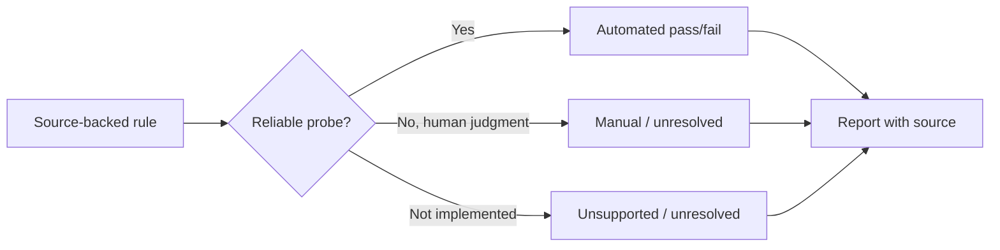

# Accessibility

Accessibility is part of figure intent and submission metadata, not a color-palette
afterthought. ResearchPlot evaluates source-backed accessibility rules where a reliable
probe exists and leaves human judgments explicit.

## What can be checked

Depending on the profile, figure, and artifact format, ResearchPlot 1.0 can inspect:

- whether plotted series differ only by color or also use line styles and markers;
- presence of alt text or a figure description in project metadata;

These are conditional, profile-backed checks. ResearchPlot does not apply an invented
universal contrast threshold or prohibit a colormap when the selected profile gives no
such rule. Automated contrast and broader color-vision simulations remain future work.

## What remains human work

Software cannot establish whether a description communicates the scientific takeaway,
whether panel order is cognitively clear, or whether a visual encoding is appropriate
for the intended audience. Such rules remain manual or unsupported and therefore
unresolved until an author supplies an attestation where the profile permits one.

!!! warning "Presence is not quality"

    A non-empty `alt_text` value can satisfy a metadata-presence check. It does not prove
    that the prose is useful. ResearchPlot never marks descriptive quality as
    automatically passed.

## Add descriptions to a bundle

```python
submission.add(
    "figure2",
    fig,
    role="main",
    width="double",
    content="combination",
    caption=(
        "Dose-response measurements for control and treatment groups. "
        "Points show medians; bands show interquartile ranges."
    ),
    alt_text=(
        "Two rising dose-response curves. The treatment curve rises earlier "
        "and plateaus approximately 20 percent above the control curve."
    ),
    source_data="data/figure2.csv",
)
```

Or declare the same metadata in `researchplot.toml`:

```toml
[[figures]]
path = "figures/figure2.pdf"
role = "main"
width = "double"
content = "combination"
caption = "Dose-response measurements for control and treatment groups."
alt_text = "Two rising curves; treatment rises earlier and plateaus higher."
source_data = "data/figure2.csv"
```

The text is recorded in the bundle manifest. When `source_data` names a file,
ResearchPlot copies it into the bundle, records its relative path, and hashes it with
the other artifacts. It does not upload or interpret the data.

## Use redundant encodings

Prefer series that remain distinguishable without hue:

```python
ax.plot(x, control, color="#0072B2", linestyle="-", marker="o", label="Control")
ax.plot(x, treatment, color="#D55E00", linestyle="--", marker="s", label="Treatment")
```

This gives viewers color, dash, and marker cues. Check a figure rather than relying on
the example colors alone; contrast depends on size, background, adjacent colors, and
the venue rule.

## Interpret accessibility findings



A warning may identify a risky encoding without claiming that every viewer will fail
to distinguish it. A skipped check is a prompt for review, not evidence of compliance.

## Practical checklist

- Describe the takeaway, chart form, variables, and important visual relationships.
- Do not repeat a long caption verbatim as alt text.
- Use line style, marker shape, texture, or direct labels in addition to color.
- Avoid encoding meaning through red versus green alone.
- Inspect grayscale output manually when the selected profile recommends it; the live
  inspector checks redundant non-color line/marker distinctions but does not simulate
  every color-vision or print process.
- Use a sequential or diverging map with a meaningful ordering instead of a rainbow
  map when venue guidance requires or recommends that choice.
- Keep text legible at the final physical width, not only when zoomed on screen.
- Record any genuinely manual verification as an attestation in the manifest.
