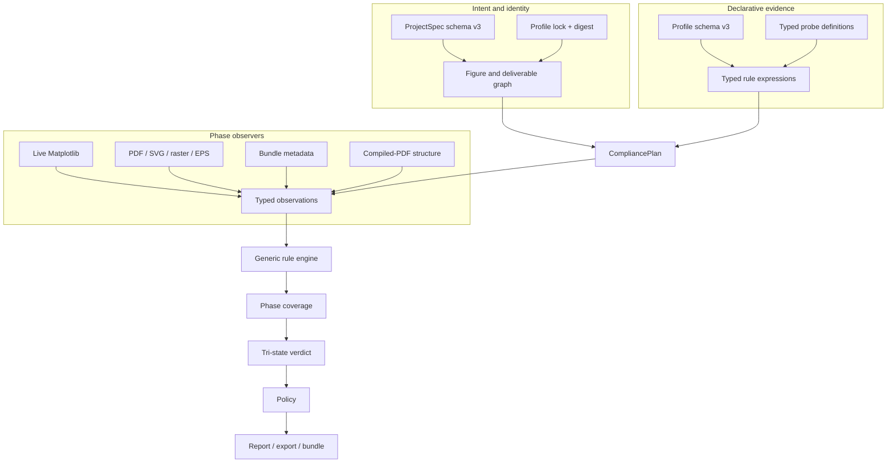
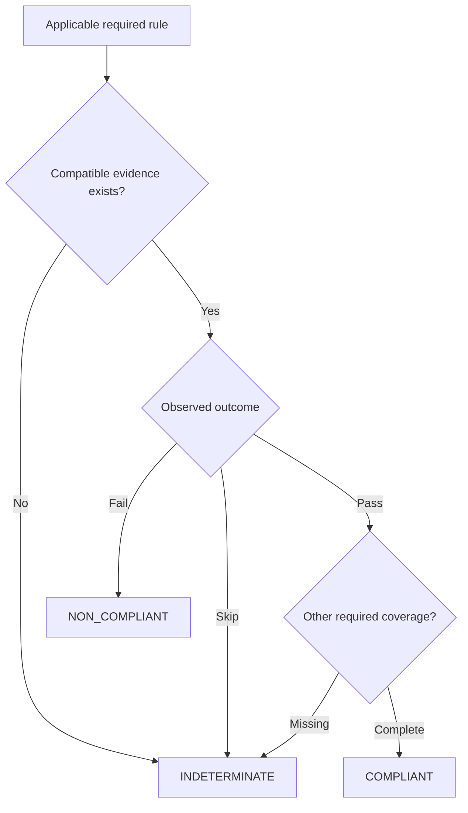
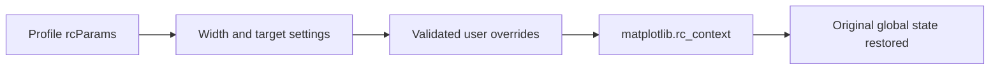
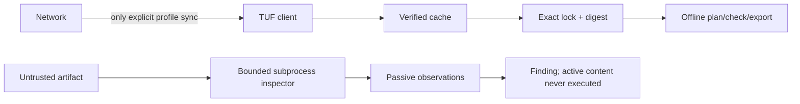

# Architecture

ResearchPlot separates project intent, venue evidence, observations, rule evaluation,
coverage, policy, and artifact writing. The separation is what lets a saved file be
useful without pretending it proves facts available only from a live figure or bundle.

## Project intent is immutable

`ProjectSpec`, `FigureSpec`, `PanelSpec`, `DeliverableSpec`, and `ManuscriptSpec` are
frozen dataclasses. Loading a schema-v3 TOML file validates structure and rejects
unknown fields, duplicate stable IDs, incompatible formats, absolute paths, parent
traversal, and resolved project-root escapes before artifact inspection begins.
Archive verification separately rejects traversal and symbolic-link entries.

`Project` resolves the exact profile and compiles every figure into a `FigurePlan` and
`ExportPlan`. A plan lists allowed and selected formats separately so an allowed
alternative is not mistaken for a required companion.

## Profiles describe; probes observe

A profile rule is data. It names typed observations, units, applicability, evidence
phases, strength, verification mode, remediation, sources, and caveats. Expressions
support controlled comparisons and composition; they cannot execute Python, templates,
or publisher-supplied code.

An inspector knows file formats, not venues. For example, a raster inspector reports
pixel dimensions, metadata DPI, color mode, bit depth, and frames. The rule engine
decides which profile assertions use those observations.

Profile validation rejects unknown or phase-incompatible probes before a profile can
participate in a plan. A heuristic observation cannot silently back a required rule.

## Coverage precedes the verdict

The same rule can be observable in one or more phases. A coverage requirement records
the logical figure, optional deliverable, rule ID, and admissible phases. Assessment
then classifies it as satisfied, failed, unresolved, or missing.

A raw `Target.audit()` report remains useful for a single file, but only a compiled
project plan knows which other phases were required.

## Style state is local

Unknown rcParams fail explicitly. LaTeX is external and opt-in; no font or template is
downloaded by the style context.

## Export and bundle boundaries

Figure export writes into private staging, inspects each candidate, evaluates policy,
and commits approved files. Handled commit failures trigger rollback. Multiple final
paths are still replaced sequentially, so abrupt termination or a non-cooperating
writer can interrupt a multi-file commit.

`Project.bundle()` currently bridges schema-v3 project intent into the v1 submission
directory/manifest implementation. It refuses structures the bridge cannot represent,
including generic attachments and multiple source-data files per figure. Deterministic
ZIP creation subsequently verifies the manifest and uses stable entry ordering,
timestamps, and permissions.

## Trust boundaries

The browser server binds only to loopback and applies a session token, origin checks,
upload limits, a restrictive content-security policy, and temporary-file cleanup. It
is a local preflight interface, not a hosted upload service.

No parser should be treated as a perfect sandbox. Use least privilege and the isolated
inspection API for untrusted inputs. Scientific correctness, manipulation detection,
and venue acceptance sit outside the system boundary.
