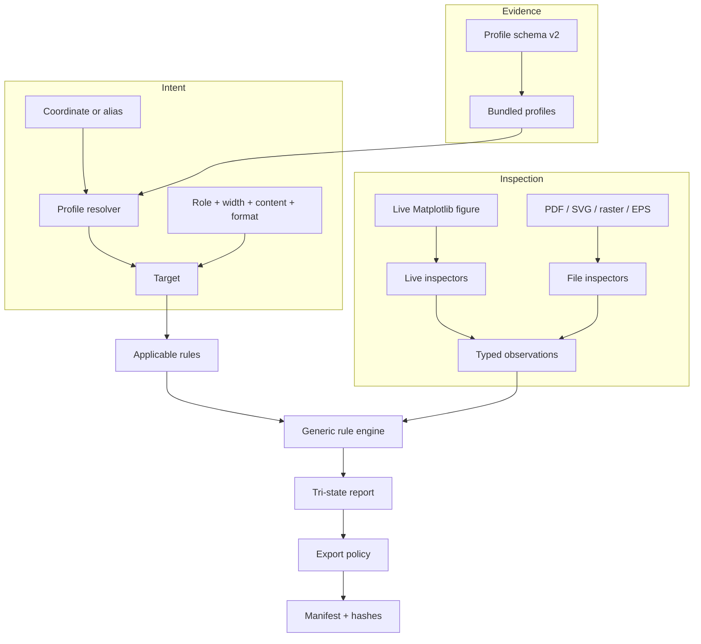
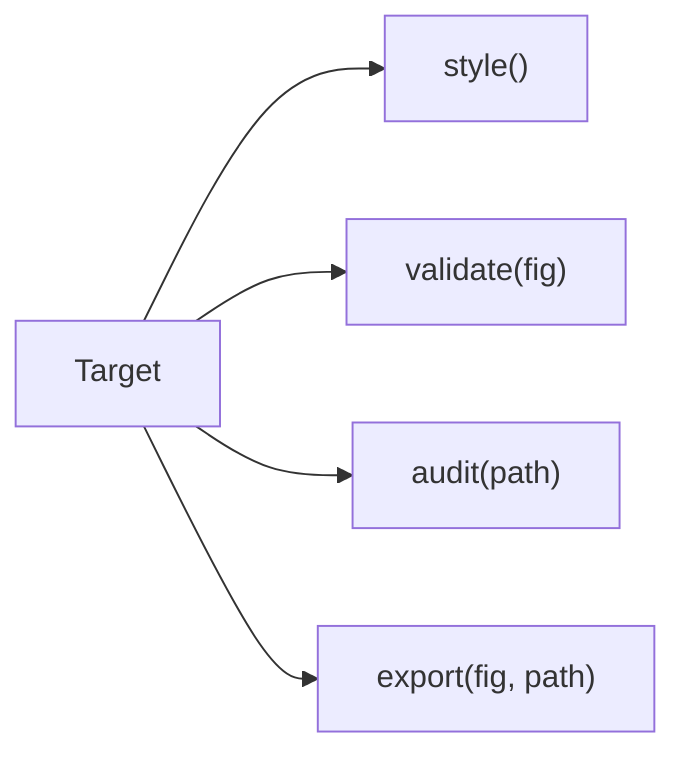

# Architecture

ResearchPlot 1.0 separates venue evidence, observation, policy, and artifact writing.
That boundary makes it possible to add a new rule or file inspector without adding a
venue-specific branch to every exporter.



## Profiles describe; inspectors observe

A profile contains declarative rules. A simplified rule says:

```json
{
  "id": "raster.minimum_resolution",
  "level": "required",
  "applies_to": {
    "role": ["main"],
    "content": ["line-art"],
    "format": ["tiff"]
  },
  "probe": "raster.dpi",
  "constraint": {
    "operator": "gte",
    "value": 600,
    "unit": "dpi"
  },
  "verification": "automated",
  "source_ids": ["publisher-resolution"]
}
```

The TIFF inspector does not know about the venue. It reports a typed observation for
`raster.dpi`. The generic rule engine applies the declared comparison and retains the
rule's source and strength in the resulting check. If no inspector can establish the
probe, the check is skipped rather than guessed.

## Target is the unit of intent

`target()` resolves a profile once and binds its conditional dimensions:

```python
target = rp.target(
    "plos-biology@2026.08.0",
    role="main",
    width="single",
    content="combination",
)
```

The target then owns the high-level operations:



This prevents mismatches such as validating for one width and exporting for another.

## Style state is local

The style context layers settings in a deterministic order:


Unknown overrides fail as invalid Matplotlib `rcParams`. LaTeX is opt-in and external;
the default configuration uses installed font fallbacks and never downloads a font.

## Export is a transaction

`Target.export()` writes into a private staging directory, audits each candidate file,
evaluates the selected policy, writes its evidence, and then moves approved files into
place. Handled commit failures trigger rollback. Because multiple destinations are
replaced sequentially, abrupt process termination and non-cooperating concurrent writers
remain outside the transaction guarantee.

The returned `ExportResult` links paths, report, and manifest. It is intentionally more
explicit than the `0.2` list of paths.

## Offline and deterministic by design

Profile discovery reads bundled package data. It performs no runtime HTTP request and
never modifies a published profile. A scheduled
repository workflow may report stale links to maintainers, but it does not rewrite
rules automatically.

An exact coordinate plus profile digest allows the same evidence to be reconstructed
from the installed package. Manifests additionally record the ResearchPlot version,
full source metadata and caveats, and SHA-256 hashes for every output artifact.

## Trust boundaries

ResearchPlot parses files supplied by the caller. Inspectors avoid executing embedded
content, loading external SVG resources, invoking LaTeX by default, or treating a
metadata field as proof of an unobservable visual property. Malformed and unsupported
files produce explicit input or capability errors.

Scientific correctness, image manipulation, and venue acceptance remain outside the
system boundary. See [Limitations and non-goals](limitations.md).
