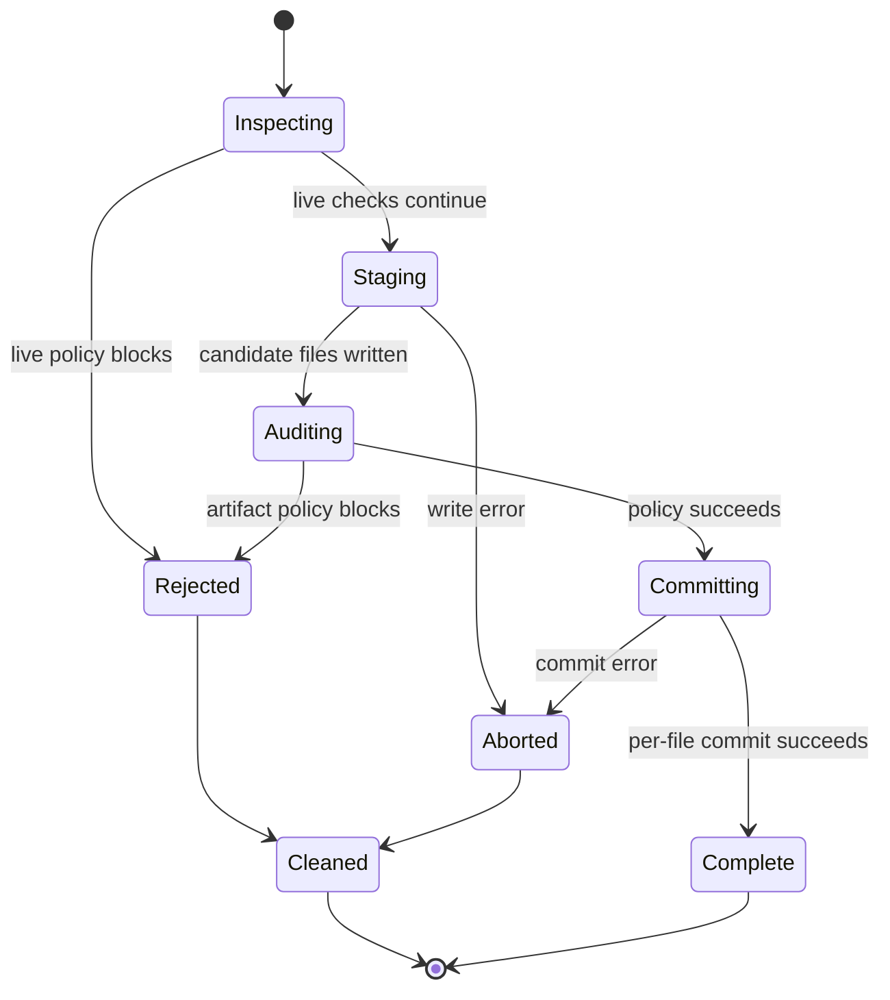
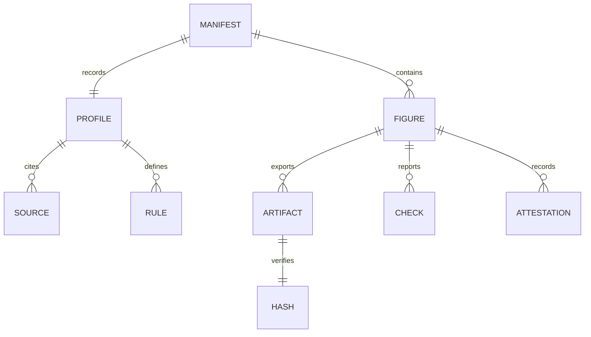

# Export and submission bundles

ResearchPlot verifies what is written, not merely what Matplotlib intended to write.
One-figure export and multi-figure bundles use the same staged, post-audited pipeline.

## Export one artifact

```python
from pathlib import Path

result = target.export(
    fig,
    Path("submission") / "figure1.pdf",
    policy="complete",
)

print(result.paths)
print(result.report.verdict)
print(result.manifest_path)
```

An `ExportResult` contains the committed output paths, the combined live/file report,
the typed `manifest`, and `manifest_path`. Unlike `0.2`, export does not return a bare
list of paths.

When a target and venue allow more than one requested representation, all candidates
belong to one staged transaction. ResearchPlot audits the complete staged set before
commit and rolls back handled commit failures.

## Transaction lifecycle



Handled commit failures trigger rollback. The final destinations of a multi-format
export are replaced sequentially; they are not an observably atomic filesystem
operation. Abrupt process termination and non-cooperating concurrent writers are
outside the rollback guarantee. A submission bundle is staged as one directory and
published with a directory rename, but an external writer racing for the same
destination is likewise outside the guarantee.

Existing destinations are handled according to the documented overwrite option;
ResearchPlot never assumes permission to replace unrelated files.

## Build a bundle in Python

```python
import researchplot as rp

submission = rp.Submission(
    "nature@2026.08.0",
    output_dir="submission",
    policy="complete",
)

submission.add(
    "figure1",
    fig1,
    role="main",
    width="single",
    content="line-art",
    formats=("pdf",),
    caption="Response increases quadratically with input.",
    alt_text="A rising curve that becomes progressively steeper.",
    source_data="data/figure1.csv",
)

submission.add(
    "figure2",
    fig2,
    role="extended-data",
    width="double",
    content="combination",
    formats=("pdf",),
    caption="Sensitivity analysis across five parameter values.",
    alt_text="Five overlapping curves with similar peaks and different tails.",
    source_data="data/figure2.csv",
)

bundle = submission.build()
print(bundle.path)
print(bundle.manifest_path)
print(bundle.passed)
for item in bundle.items:
    print(item.name, item.report.verdict)
```

`Submission.add()` records intent and metadata. `build()` performs the writes and
policy decision. Adding an object does not mutate the output directory.

## Build from configuration

```bash
researchplot bundle build --config researchplot.toml
```

This is the recommended release workflow because the declarative configuration and
profile lock can be reviewed with the manuscript.

## Manifest contents

The generated `researchplot-manifest.json` includes:

- manifest schema and ResearchPlot versions;
- exact profile coordinate, digest, source records, and caveats;
- per-figure role, width, content kind, and output format;
- expected and observed dimensions and artifact metadata;
- automated check results, their full source metadata, skipped checks, and manual
  attestations;
- caption, alt text, and a bundled source-data path when supplied;
- SHA-256 hash and relative path for every committed artifact.



When `source_data` names a file, ResearchPlot copies it under `source-data/`, records its
relative path, and includes its SHA-256 artifact record. It does not interpret or upload
research data.

See [Manifest and report formats](formats.md) for serialization stability.

## Audit an existing artifact

```python
report = target.audit("external/figure1.pdf")
```

Or:

```bash
researchplot check external/figure1.pdf \
  --profile nature@2026.08.0 \
  --role main \
  --width single \
  --content line-art
```

Supported artifact families are PDF, SVG, PNG, JPEG, TIFF, and EPS. Capabilities vary by
format:

| Format | Examples of available evidence |
| --- | --- |
| PDF | All page boxes, recursive font resources, embedding, and Type 3 fonts. |
| SVG | Physical dimensions, `viewBox`, text nodes, font declarations, embedded assets, external references. |
| PNG/JPEG/TIFF | Pixel dimensions, effective DPI, color mode, bit depth, ICC metadata, compression, file size. |
| EPS | `BoundingBox`, `HiResBoundingBox`, physical dimensions, and allowed format. |

Unavailable checks are marked skipped. For example, raster pixels normally cannot
prove which font family was used before rasterization.

## Reproducibility checks

The file hash proves byte identity, not scientific validity. Rebuilding the same figure
may produce a different byte stream because a backend embeds timestamps or identifiers;
the manifest still allows reviewers to verify the exact artifact that was submitted.

Use a pinned profile coordinate and committed lock file to make the rule evidence
reproducible as well.
