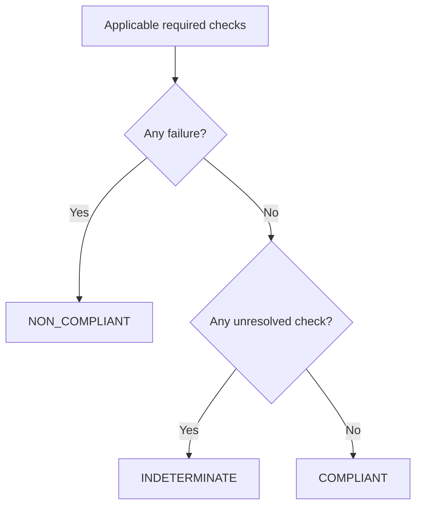

# Compliance reports

ResearchPlot treats rule importance and observed outcome as independent dimensions.
This prevents an unobservable required rule from appearing to pass and prevents a
recommendation from becoming an accidental hard requirement.

## Rule levels

| Level | Meaning | Blocking behavior |
| --- | --- | --- |
| `required` | The official source states a requirement. | A failure makes the report non-compliant. An unresolved check makes it indeterminate. |
| `recommended` | The source recommends or prefers the behavior. | Produces warnings but does not make the report non-compliant. |
| `inferred` | ResearchPlot-derived guidance, clearly identified as such. | Informational only and never blocks export. |

Profiles leave a property unspecified when official guidance is absent. They do not
promote a common practice into a venue rule.

## Check outcomes

| Outcome | Meaning |
| --- | --- |
| `pass` | The inspector established that the constraint is satisfied. |
| `fail` | The inspector established that the constraint is violated. |
| `skip` | The constraint applies, but the available evidence cannot establish it. |

Rules that do not apply to the selected target and phase are not emitted as findings.

The exact enum spelling is stable in serialized reports; Python code should use the
published enum members rather than comparing display labels.

## Report verdicts



Recommendations and inferred guidance are still included in every verdict.

```python
report = target.validate(fig)

match report.verdict:
    case rp.Verdict.COMPLIANT:
        print("All applicable required checks passed")
    case rp.Verdict.NON_COMPLIANT:
        for check in report.failures:
            print(check.message)
    case rp.Verdict.INDETERMINATE:
        for check in report.unresolved:
            print(check.message)
```

Convenience collections expose `failures`, `warnings`, and `unresolved`; `findings`
contains the complete ordered evidence and `to_dict()` produces the versioned machine
representation.

## Policies

A verdict describes evidence. A policy decides whether an operation may continue:

| Policy | Blocks `NON_COMPLIANT` | Blocks `INDETERMINATE` | Use case |
| --- | :---: | :---: | --- |
| `complete` | Yes | Yes | Release and submission CI; default export policy. |
| `violations` | Yes | No | Incremental adoption where unresolved checks are reviewed manually. |
| `off` | No | No | Generate evidence without enforcement. |

Policy does not erase findings. An `off` export still returns the same report and
records it in the manifest.

## Automated, manual, and unsupported verification

Each profile rule declares its verification mode:

- **Automated**: an inspector can establish the rule from a live figure or file.
- **Manual**: a person must inspect or attest to the condition.
- **Unsupported**: ResearchPlot has no reliable probe for this rule yet.

Manual requirements begin unresolved. Python workflows can provide an explicit
attestation, which is recorded with the figure report instead of being confused with
an automated observation:

```python
report = target.validate(
    fig,
    attestations={
        "panels.order.logical": "Panels are ordered left-to-right, then top-to-bottom."
    },
)
```

An attestation is evidence supplied by the author, not a claim that ResearchPlot
verified the content independently.

## Sources travel with findings

Every check can expose:

- profile coordinate, digest, and target context;
- rule ID, level, phase, and verification mode;
- observed and expected values;
- official source IDs, titles, URLs, locators, and verification dates;
- a focused suggestion when remediation is mechanical.

Report/profile metadata also carries caveats. Together, these make a result reviewable
without trusting a green badge in isolation.

## Live validation versus artifact auditing

Live validation can see Matplotlib artists, font sizes, lines, markers, labels, and
figure dimensions. File auditing can see the actual page box, serialized fonts,
resolution metadata, color modes, and format-level restrictions.

Export combines both stages. A check can legitimately differ between them—for example,
a font visible in Matplotlib can become an unembedded font in a PDF. The post-export
artifact result is therefore part of the final report.

## JSON and SARIF

Use JSON for stable programmatic consumption:

```bash
researchplot check --config researchplot.toml --format json > report.json
```

Use SARIF for CI annotations:

```bash
researchplot check --config researchplot.toml --format sarif > researchplot.sarif
```

The [manifest and report formats](formats.md) page documents versioning and paths.
