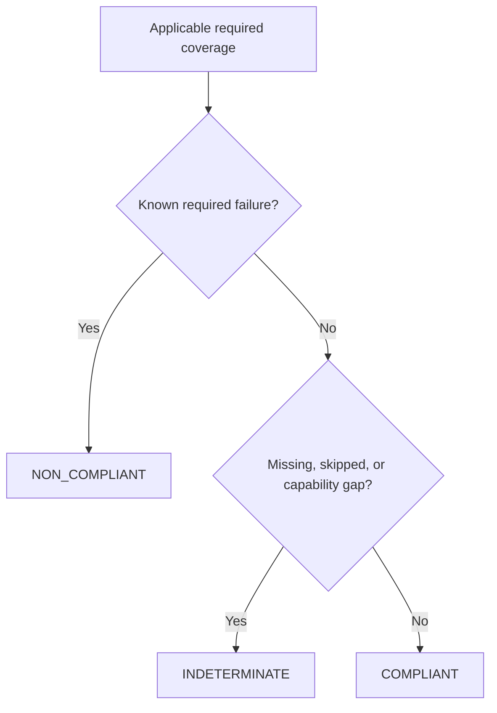

# Compliance reports

ResearchPlot keeps four questions separate:

1. How strong is the venue rule?
2. What did this observer establish?
3. Were all required evidence phases covered?
4. Which policy should block the current operation?

That separation prevents a recommendation from becoming an accidental hard failure and
prevents an unavailable required check from appearing to pass.

## Rule levels

| Level | Meaning | Effect on venue verdict |
| --- | --- | --- |
| `required` | The cited official source states a requirement. | A failure is non-compliant; missing or skipped evidence is indeterminate. |
| `recommended` | The source recommends or prefers the behavior. | Reported as guidance; does not make the venue verdict non-compliant. |
| `inferred` | ResearchPlot-derived guidance, explicitly labeled. | Informational and never blocks the venue verdict. |

When official guidance is absent, the profile leaves the property unspecified.

## Findings and normalized statuses

The v2 public vocabulary is `PASS`, `FAIL`, `WARNING`, `INFO`, `SKIPPED`, and
`NOT_APPLICABLE`. The compatibility `Report` used by `Target` stores low-level
`Outcome.PASS`, `Outcome.FAIL`, and `Outcome.SKIP`; strength determines whether a failed
finding is a failure, warning, or information in a rendered result.

Not-applicable rules do not produce a failed check. An operational problem—unreadable
input, an unsafe path, parser failure, timeout, or missing required capability—is an
exception and CLI exit code `2`, not a compliance finding.

## Phase coverage

Rules identify the phases capable of providing evidence:

- **live**: Matplotlib figure dimensions and artists;
- **file**: serialized PDF/SVG/EPS/raster structure and metadata;
- **bundle**: configured prose, source data, deliverables, attestations, and manifests;
- **manuscript**: compiled-PDF structure and, when supported, placement evidence.

`CompliancePlan` compiles each applicable required rule into a `CoverageRequirement`.
Assessment records the status of that requirement as satisfied, failed, unresolved, or
missing.



For example, an external PDF can establish its page width and whether its fonts are
embedded. It cannot reliably prove all original Matplotlib font settings. If the
profile requires live typography evidence, a project with only that PDF is
`INDETERMINATE` even when every file-phase check passes.

## Report interfaces

A v2 project check returns `PlanAssessment` (also exported as `ValidationReport`):

```python
report = project.plan(frozen=True).check()

report.verdict
report.passed  # true only for COMPLIANT
report.failures
report.warnings
report.unresolved
report.coverage
report.capability_gaps
report.remediations
report.sources
payload = report.to_dict()
```

`to_dict()` emits schema version 2 and includes the profile coordinate/digest, summary,
official sources, flat findings, remediation strings, coverage, capability gaps, and
the phase reports that supplied evidence.

Do not use `.passed` to erase the distinction between a known violation and missing
evidence. Branch on `Verdict` when behavior differs:

```python
match report.verdict:
    case rp.Verdict.COMPLIANT:
        publish()
    case rp.Verdict.NON_COMPLIANT:
        show_failures(report.failures)
    case rp.Verdict.INDETERMINATE:
        request_evidence(report.unresolved, report.capability_gaps)
```

## Policies

A verdict describes evidence. A policy controls whether an export or bundle operation
continues:

| Policy | Blocks `NON_COMPLIANT` | Blocks `INDETERMINATE` | Typical use |
| --- | :---: | :---: | --- |
| `complete` | Yes | Yes | Release and submission CI. |
| `violations` | Yes | No | Incremental authoring while gaps remain visible. |
| `off` | No | No | Evidence generation without enforcement. |

Policy never changes the report. An `off` export retains the same findings and does not
become venue-compliant merely because publication was allowed.

## Attestations and waivers

An attestation can satisfy only a rule whose profile verification mode permits manual
evidence. Schema-v3 configuration records reviewer identity, an ISO date, rationale,
and referenced evidence:

```toml
[figures.attestations."metadata.alt_text.distinct_from_caption"]
reviewer = "A. Researcher"
date = "2026-08-03"
rationale = "The description states the key trend not repeated in the caption."
evidence = ["reviews/figure1-accessibility.md"]
```

The rule ID is the table key and is also bound into the frozen `ManualAttestation`
object. This example applies to the manual rule in `acm-acmart`; an attestation for an
automated or unknown rule cannot manufacture a pass. String-only statements remain
readable as a deprecated v1 compatibility form.

Waivers record an exact profile digest, reviewer, reason, and expiry:

```toml
[figures.waivers."figure.title.prohibited"]
profile_digest = "c1a79e3c48483773284ecde6024f7b65ec0fa657b88f29fd8b7e23e421110ffa"
reviewer = "A. Researcher"
reason = "Recommendation reviewed; title retained during author review."
expires_on = "2026-09-30"
```

`Waiver.expired` is computed against the current date. A digest mismatch is rejected;
an expired waiver is preserved but omitted from active planning. A waiver may appear in
manifest metadata but never converts a required violation into `COMPLIANT`.

## Heuristics remain advisory

Color-vision previews and visual diagnostics expose deterministic images or measured
signals, but their interpretation is heuristic. They are review prompts unless a
profile has a compatible verified rule and probe. ResearchPlot never treats a global
contrast metric as proof that every meaningful graphical object meets a threshold.

## CLI and machine output

```bash
researchplot check --config researchplot.toml --format json --output build/report.json
researchplot check --config researchplot.toml --format sarif --output build/report.sarif
```

Self-contained HTML can also be produced from Python:

```python
rp.write_html_report(report, "build/report.html")
```

CLI exit codes are stable:

| Code | Meaning |
| --- | --- |
| `0` | Compliant. |
| `1` | At least one required rule fails. |
| `2` | Invalid or unsafe input, parser failure, resource limit, or missing operational capability. |
| `3` | Required evidence is unavailable, so the result is indeterminate. |
