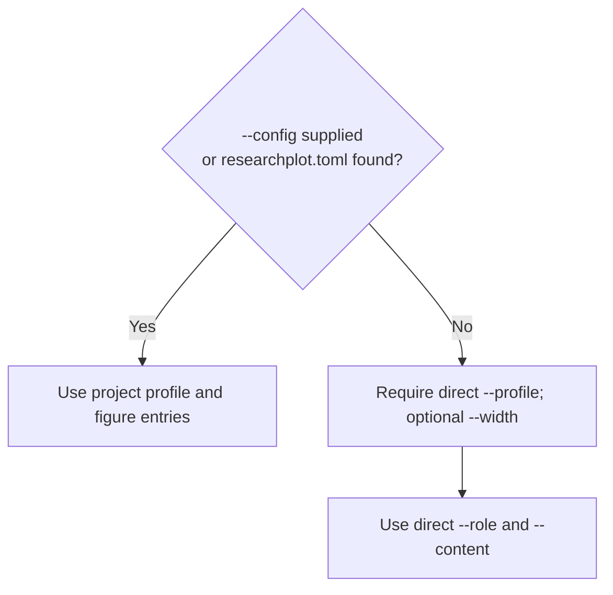

# Project configuration

`researchplot.toml` turns one-off commands into a reviewable contract for every figure
in a paper. Commit it with the manuscript and use the same file locally and in CI.

## Minimal configuration

```toml
profile = "nature@2026.08.0"
policy = "complete"

[[figures]]
path = "figures/figure1.pdf"
role = "main"
width = "single"
content = "line-art"
alt_text = "A line chart showing response increasing with input."
source_data = "data/figure1.csv"
```

Figure `path` and `source_data` values are interpreted relative to the configuration
file, not the shell's current working directory. A bundle build copies supplied source
data into its `source-data/` directory and hashes it. A profile can declare defaults,
but target-critical values should remain explicit in a submission configuration.

## Multiple figures and per-figure formats

```toml
profile = "nature@2026.08.0"
policy = "complete"

[[figures]]
path = "figures/figure1.pdf"
role = "main"
width = "single"
content = "line-art"
caption = "Model error decreases as training data increases."
alt_text = "A descending curve that flattens beyond 10,000 observations."
source_data = "data/figure1.csv"

[[figures]]
path = "figures/figure2.tiff"
role = "main"
width = "double"
content = "halftone"
caption = "Representative microscopy images at three time points."
alt_text = "Three microscopy panels showing progressively denser cell coverage."
source_data = "data/figure2.csv"
```

Invalid required values, malformed enum values, unreadable paths, and invalid profiles
are input errors. Keep configuration to the documented keys; unknown-key rejection is
not a 1.0 compatibility promise.

## Check a project

```bash
researchplot check --config researchplot.toml
```

Check one file or directory in direct mode:

```bash
researchplot check figures/figure1.pdf --profile nature@2026.08.0 --width single
researchplot check figures/ --profile nature@2026.08.0 --width single
```

When `--config` is used, positional paths are not overrides; the command checks the
figure entries declared by that configuration.

Choose a machine format:

```bash
researchplot check --config researchplot.toml --format json > build/report.json
researchplot check --config researchplot.toml --format sarif > build/researchplot.sarif
```

The CLI writes structured output to standard output and diagnostics to standard error,
so redirection remains safe.

## Lock profile evidence

```bash
researchplot profile lock nature@2026.08.0
researchplot profile lock nature@2026.08.0 --output researchplot.lock.json
```

Commit the resulting lock file. It records the exact profile coordinate, digest, and
sources. Profile locking is an explicit evidence snapshot in 1.0; `check` does not yet
consume the lock automatically, so CI should also pin the package version.

Inspect before changing a revision:

```bash
researchplot profile diff nature@2026.08.0 ieee-journal@2026.08.0
```

## Exit codes

| Code | Meaning | Suggested CI behavior |
| ---: | --- | --- |
| `0` | All targets are compliant. | Pass. |
| `1` | At least one target is non-compliant. | Fail and fix violations. |
| `2` | Invalid input, unreadable artifact, invalid profile, or missing required capability. | Fail the job or environment. |
| `3` | No required failure is known, but at least one required check is unresolved. | Require manual review or evidence. |

Policy changes whether export/build operations proceed; it does not change these
report verdict meanings.

## GitHub Actions

The repository ships a composite action. Pin a release tag and grant
`security-events: write` only when uploading SARIF:

```yaml
name: Figure compliance

on:
  push:
  pull_request:

permissions:
  contents: read
  security-events: write

jobs:
  figures:
    runs-on: ubuntu-latest
    steps:
      - uses: actions/checkout@v6
      - uses: Devrajsinh-Jhala/ResearchPlot@v1.0.0
        with:
          version: "1.0.0"
          config: researchplot.toml
          upload-sarif: "true"
```

The action preserves ResearchPlot exit codes and exposes `sarif-file` and `exit-code`
outputs. If code scanning is unavailable, leave `upload-sarif` false and retain the
generated file as a workflow artifact.

The equivalent explicit workflow is:

```yaml
name: Figure compliance

on:
  push:
  pull_request:

permissions:
  contents: read
  security-events: write

jobs:
  figures:
    runs-on: ubuntu-latest
    steps:
      - uses: actions/checkout@v6
      - uses: actions/setup-python@v6
        with:
          python-version: "3.11"
      - run: python -m pip install researchplot-venues
      - name: Check figures
        run: researchplot check --config researchplot.toml --format sarif > researchplot.sarif
      - name: Upload findings
        if: always() && hashFiles('researchplot.sarif') != ''
        uses: github/codeql-action/upload-sarif@v4
        with:
          sarif_file: researchplot.sarif
```

If code scanning is unavailable for a repository, use text or JSON output and retain it
as a workflow artifact instead.

## Pre-commit

The packaged hook checks the project configuration rather than receiving staged
filenames:

```yaml
repos:
  - repo: https://github.com/Devrajsinh-Jhala/ResearchPlot
    rev: v1.0.0
    hooks:
      - id: researchplot-check
```

This is useful only when the configured artifacts exist before the commit. Keep release
CI as the authoritative bundle check.

## Configuration versus direct mode



Arguments for direct mode do not override individual figure entries when a configuration
is loaded. Profile rules themselves are never weakened by project configuration.

## Validate before CI

```bash
researchplot profile validate src/researchplot/profiles/nature.json
researchplot check --config researchplot.toml
researchplot bundle build --config researchplot.toml
```

The first command is for profile authors. Most projects need only `check` and
`bundle build`.
