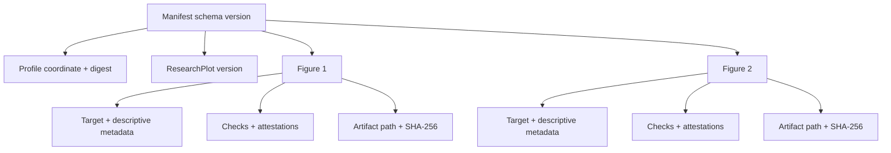

# Manifest and report formats

ResearchPlot emits versioned JSON for programmatic use and SARIF 2.1.0 for compatible
code-scanning systems. Human text output is intentionally not a machine contract.
The immutable v1 [report schema](https://raw.githubusercontent.com/Devrajsinh-Jhala/ResearchPlot/v1.0.0/schemas/report.schema.json),
[single-export manifest schema](https://raw.githubusercontent.com/Devrajsinh-Jhala/ResearchPlot/v1.0.0/schemas/export-manifest.schema.json),
and [submission-bundle manifest schema](https://raw.githubusercontent.com/Devrajsinh-Jhala/ResearchPlot/v1.0.0/schemas/submission-manifest.schema.json)
are bundled in the wheel and available through `rp.report_schema()`,
`rp.export_manifest_schema()`, and `rp.submission_manifest_schema()`. Manifest schemas
contain only local JSON pointers, so validation remains offline.

## Validation report

Use `Report.to_dict()` in Python:

```python
payload = result.report.to_dict()
```

CLI `--format json` returns a batch list of `{"path": ..., "report": ...}` objects,
including when only one artifact is checked. Validate each nested `report` value against
the report schema; the outer list is a transport envelope rather than a report.

The report representation includes:

- its schema version;
- final verdict and target metadata;
- exact profile coordinate, digest, target context, and profile caveats;
- one entry per applicable or evaluated check;
- rule level, outcome, verification mode, and message;
- expected and observed values;
- full source records with IDs, titles, URLs, locators, and verification dates;
- remediation suggestion where one is reliable;
- originating artifact path or live-figure stage where applicable.

The v1 schemas are strict and reject unknown fields. Consumers should check the
schema-version field before assuming a structure and compare enum values exactly. They
should not parse the human-readable `message` to recover values exposed separately.

`Target.export()` writes a sidecar single-export manifest containing one target,
artifact records, caller metadata, and its combined live/file report. Its Python type is
`ExportManifest`.

## Bundle manifest

`researchplot-manifest.json` describes the exact bundle that was committed:



Paths in a portable bundle are relative to its root. A supplied source-data file is
copied into the bundle and hashed, but it is not parsed or scientifically validated.

SHA-256 lets a reviewer confirm byte identity. It does not establish that the content
is correct or unmanipulated.

## SARIF

```bash
researchplot check --config researchplot.toml --format sarif > researchplot.sarif
```

ResearchPlot maps findings to SARIF levels without changing their native rule level or
outcome in the attached properties. File-backed findings include artifact locations
where possible. Project-level or live-figure findings may not have a source-code line.

Do not derive the ResearchPlot verdict from SARIF severity alone. Preserve the native
JSON report or manifest when downstream automation needs the full tri-state model.

## Compatibility policy

Within a major ResearchPlot release:

- serialized enum meanings and required fields remain stable;
- new rule IDs may be added as venue evidence evolves;
- text phrasing, ordering of unrelated checks, and suggestions may improve;
- any added, removed, or renamed document field requires a schema-version change;
- a backwards-incompatible representation waits for a new ResearchPlot major release.

Profile schema version, report schema version, manifest schema version, package version,
and profile revision are separate. Consumers should not substitute one for another.

## Validate hashes

The standard library is enough to verify one artifact:

```python
from hashlib import sha256
from pathlib import Path

path = Path("submission/figure1.pdf")
actual = sha256(path.read_bytes()).hexdigest()
assert actual == manifest_hash
```

Read the hash from the parsed manifest rather than copying it into source code in a
real project.
