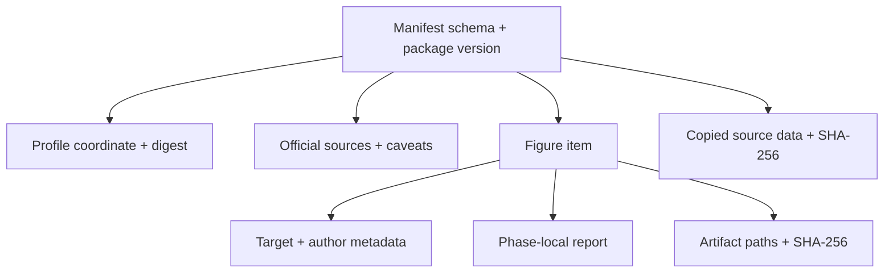

# Reports, manifests, and archives

ResearchPlot emits versioned JSON for programs, SARIF 2.1.0 for code scanning, and
self-contained HTML for human review. Human terminal text is not a machine contract.

## Coverage-aware report schema v2

`Project.check()` and `ExecutablePlan.check()` return `PlanAssessment`. Its dictionary
form has `schema_version: 2` and contains:

- exact profile coordinate and digest;
- deterministic compliance-plan digest;
- tri-state verdict and summary counts;
- unique official source records;
- flat findings and remediation strings;
- coverage requirements with satisfied/failed/unresolved/missing status;
- capability gaps;
- privacy-safe environment provenance (versions, backend, font-family settings,
  LaTeX availability, rcParams digest, and inspector protocol; no username/hostname);
- the live/file/bundle phase reports that supplied the evidence.

```python
project = rp.Project.load("researchplot.toml")
report = project.plan(frozen=True).check()
payload = report.to_dict()
```

The strict schema is bundled in the wheel and available without network access:

```python
schema = rp.validation_report_schema()
```

Treat `schema_version` as mandatory and validate the complete payload before consuming
coverage or provenance fields.

## Compatibility report schema v1

`Target.validate()`, `Target.audit()`, and `Target.export().report` use the v1 `Report`
model. Its published schema remains available through:

```python
schema = rp.report_schema()
```

The v1 report includes target context, exact profile identity, verdict, profile
caveats, findings, expected/observed values, source metadata, and suggestions. It is
phase-local and must not be treated as project-wide coverage.

When the CLI audits multiple artifacts, JSON output wraps reports in a transport list
with each artifact path. Validate the nested report, not the transport envelope,
against the v1 report schema.

## Export manifest

`FigureTarget.export()` and `Target.export()` write a sidecar single-export manifest
for the live/file export transaction. Its schema is available through:

```python
schema = rp.export_manifest_schema()
```

The manifest records the package version, profile identity, target intent, artifacts,
hashes, metadata, and the combined v1 report. Schema-v3 figure metadata such as figure
ID, number, caption, short/long description, and waivers is added to the export metadata
when exporting through `FigureTarget`.

## Submission manifest

`Submission.build()` and the current `Project.bundle()` bridge write
`researchplot-manifest.json`. Its schema is available through:

```python
schema = rp.submission_manifest_schema()
```



Paths are portable and relative to the bundle root. SHA-256 establishes byte identity,
not scientific validity or provenance of authorship.

The current bridge is manifest schema v1 and cannot represent every schema-v3 project
field. In particular, multiple source-data files, generic attachments, typed
attestation/waiver metadata, and full panel/long-description structures need the future v2
bundle contract. The bridge rejects some unrepresentable projects rather than writing
misleading metadata.

## Manifest and archive verification

```python
directory_result = rp.verify_manifest("dist/submission")
archive = rp.create_deterministic_archive(
    "dist/submission",
    "dist/submission.zip",
)
archive_result = rp.verify_deterministic_archive("dist/submission.zip")
```

Verification checks JSON shape and limits, safe relative paths, member type, size,
digest, missing/extra artifacts, collisions, and deterministic ZIP or TAR metadata.
Archives are inspected in place without extracting members. Traversal and symbolic-link
entries are rejected.

`create_deterministic_archive()` accepts `.zip` and uncompressed `.tar` destinations.
It normalizes ordering, timestamps, ownership, and permissions and honors
`SOURCE_DATE_EPOCH`; an invalid or out-of-range epoch is rejected. Transactional PDF and
SVG exports normalize volatile producer/date metadata and SVG identifiers so repeated
exports are byte-stable under the tested backend and dependency set.

## SARIF

```bash
researchplot check --config researchplot.toml \
  --format sarif \
  --output build/researchplot.sarif
```

SARIF maps findings to scanner levels and retains ResearchPlot-specific properties.
Do not derive a project verdict from SARIF severity alone; retain native JSON when
coverage and the distinction between `NON_COMPLIANT` and `INDETERMINATE` matter.

## Self-contained HTML

```python
rp.write_html_report(report, "build/researchplot.html")
```

HTML includes embedded JSON but no external scripts, stylesheets, fonts, or images. It
is suitable for an offline review artifact. Treat the embedded JSON as the same report
payload, not as a separately versioned contract.

## JATS and RO-Crate

```python
jats = rp.submission_manifest_to_jats("dist/submission/researchplot-manifest.json")
crate = rp.submission_manifest_to_ro_crate("dist/submission/researchplot-manifest.json")
```

These are deterministic projections of manifest data. They never infer missing prose
or inspect the scientific content of referenced files.

## Versioning policy

Package version, project schema, profile schema, profile revision, report schema,
manifest schema, lock schema, JATS version, and RO-Crate version are independent.
Consumers must inspect the relevant field rather than infer one from another.

Within a published schema version, enum meanings and required fields are stable. New
profile rules can appear in a new immutable profile revision without changing the
serialization schema.
