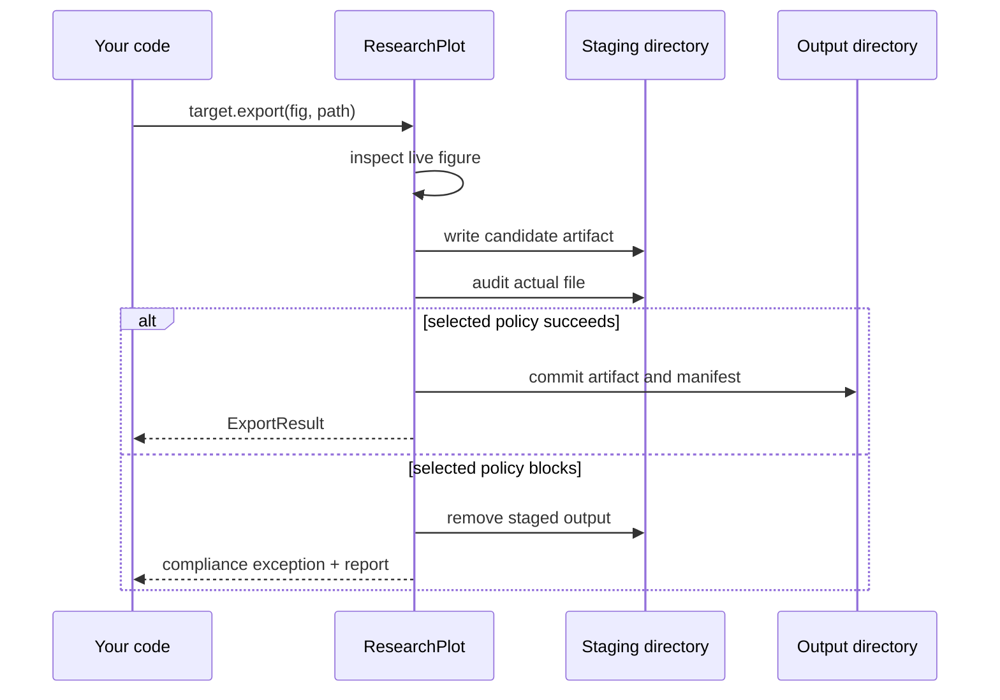

# Getting started

This guide creates one figure at Nature's single-column width, exports it as PDF, and
inspects the compliance evidence.

## 1. Install

Create an isolated environment with Python 3.11 or newer:

=== "Windows PowerShell"

    ```powershell
    py -3.11 -m venv .venv
    .venv\Scripts\Activate.ps1
    python -m pip install --upgrade pip
    python -m pip install researchplot-venues
    ```

=== "macOS and Linux"

    ```bash
    python3.11 -m venv .venv
    source .venv/bin/activate
    python -m pip install --upgrade pip
    python -m pip install researchplot-venues
    ```

The distribution name is `researchplot-venues`, but imports and commands use
`researchplot`. Confirm both:

```bash
python -c "import researchplot as rp; print(rp.__version__)"
researchplot --version
researchplot profile list
```

No network connection, LaTeX installation, or downloaded font is required at runtime.

## 2. Select a reproducible target

A target combines a profile revision with the semantic information needed to choose
applicable rules:

```python
import researchplot as rp

target = rp.target(
    "nature@2026.08.0",
    role="main",
    width="single",
    content="line-art",
)
```

- `role` distinguishes main, supplementary, extended-data, and other venue roles.
- `width` names one of the physical widths declared by the selected profile.
- `content` describes the artwork—not the output file. Typical values are `line-art`,
  `halftone`, and `combination`.

Use a pinned `<profile-id>@<revision>` coordinate in a paper repository. Unpinned IDs
and aliases are useful for discovery, but emit a warning with the revision selected.

## 3. Style without changing global Matplotlib state

```python
import matplotlib.pyplot as plt

with target.style() as style:
    fig, ax = style.subplots(aspect=0.62)
    ax.plot(
        [0, 1, 2, 3],
        [0, 1, 4, 9],
        marker="o",
        label="Measured response",
    )
    ax.set(xlabel="Input", ylabel="Response")
    ax.legend(frameon=False)
```

`style.subplots()` creates the exact final width. `aspect` is height divided by width;
an explicit noncompliant height raises an error rather than being silently clamped.
The style uses `matplotlib.rc_context`, so all global settings are restored even when
an exception leaves the `with` block.

You can use any Matplotlib artist. ResearchPlot does not replace `Axes.plot`, Seaborn,
pandas plotting, or another library that draws into a Matplotlib figure.

## 4. Export and audit

```python
from pathlib import Path

result = target.export(
    fig,
    Path("submission") / "figure1.pdf",
    policy="complete",
)

print(result.report.verdict)
for check in result.report.findings:
    print(check.rule_id, check.outcome, check.message)

print(result.paths)
print(result.manifest_path)
plt.close(fig)
```

Export is transactional:



The default `complete` policy blocks a required failure or an unresolved required
check. See [Compliance reports](compliance.md) to choose another policy intentionally.

## 5. Audit an existing artifact

Use the same target for a file made by another tool:

```python
report = target.audit("figures/figure1.pdf")
print(report.verdict)
print(report.to_dict())
```

Or from a shell:

```bash
researchplot check figures/figure1.pdf \
  --profile nature@2026.08.0 \
  --role main \
  --width single \
  --content line-art
```

## Next steps

- Define all figures in [a `researchplot.toml` project](configuration.md).
- Build [a complete submission bundle](bundles.md).
- Read [profile provenance and pinning](profiles.md).
- Add [accessibility metadata and checks](accessibility.md).
