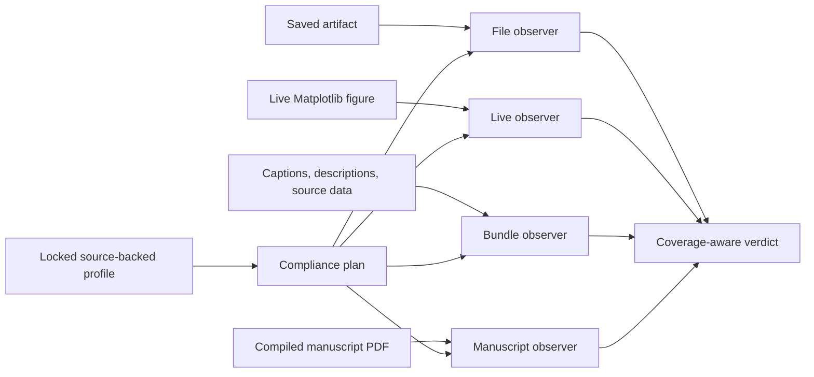

# ResearchPlot 2.0

## Know what your figure proves before you submit it

ResearchPlot is a local, source-backed venue-compliance compiler. Drop in an existing
PDF, SVG, EPS, PNG, JPEG, or TIFF; pair it with an immutable venue profile; and get a
report that separates verified requirements, known failures, recommendations, and
evidence the software could not establish.

!!! important "Evidence, not an acceptance guarantee"

    `COMPLIANT` means every applicable **encoded** required rule is covered and passes.
    It does not validate scientific correctness, replace the official author guide, or
    guarantee editorial acceptance. Every report carries its source URLs, caveats,
    profile digest, and unresolved checks.

<div class="rp-pipeline" role="img" aria-label="An animated workflow from a research figure and locked venue profile through local inspection to a coverage-aware report and verified submission bundle">
  <span>Figure</span><i>+</i><span>locked venue</span><b>→</b><span>local inspection</span><b>→</b><span>coverage</span><b>→</b><span>report</span><b>→</b><span>bundle</span>
</div>

<figure class="rp-architecture">
  
  <figcaption>The moving evidence path respects reduced-motion preferences.</figcaption>
</figure>



## Audit a saved file

```bash
python -m pip install researchplot-venues

researchplot audit figures/figure1.pdf \
  --profile nature@2026.08.0 \
  --role main \
  --width single \
  --content line-art
```

The distribution is `researchplot-venues`; the Python package and command are both
`researchplot`. Base installation is offline at runtime and does not require LaTeX.

[Start with an artifact](getting-started.md){ .md-button .md-button--primary }
[Explore ResearchPlot 2.0](v2.md){ .md-button }

## Three truthful verdicts

| Verdict | What ResearchPlot established |
| --- | --- |
| `COMPLIANT` | All applicable encoded required checks have sufficient evidence and pass. |
| `NON_COMPLIANT` | At least one applicable required rule is known to fail. |
| `INDETERMINATE` | No required failure is known, but required evidence or capability is missing. |

A file-only audit can be useful without being complete. For example, PDF resources may
show whether fonts are embedded, but the PDF cannot reliably reconstruct every
Matplotlib artist's original typeface and size. A project report preserves that gap
instead of converting it into a green result.

## One project, every deliverable

Schema-v3 projects connect a pinned profile to logical figures, concrete deliverables,
captions, short and long descriptions, panels, source data, author attestations, and an
optional compiled manuscript PDF.

```python
import researchplot as rp

project = rp.Project.load("researchplot.toml")
report = project.plan(frozen=True).check()

print(report.verdict)
print(report.coverage)
print(report.sources)
print(report.remediations)
```

When creating a Matplotlib figure, the same project supplies an exact physical style
and keeps the live evidence:

```python
figure = project.figure("figure-1")

with figure.style(deliverable="main") as style:
    fig, ax = style.subplots(aspect=0.62)
    ax.plot(x, y, marker="o")
    report = figure.check(fig=fig)
    result = figure.export(fig, policy="violations")
```

## Why ResearchPlot is different

### Sources travel with every rule

Profiles are immutable, digest-addressed data. Each rule states its strength,
applicability, supported evidence phases, verification mode, official source URL and
locator, review status, and caveats. Missing official guidance is not invented.

### The submitted file is inspected

ResearchPlot audits actual PDF/SVG/EPS/raster output, reports passive active content,
and can run bounded inspection in a subprocess. It also creates deterministic visual
accessibility previews and advisory diagnostics without generating prose or changing
scientific data.

### Automation remains reviewable

Terminal, JSON, SARIF, and self-contained HTML views derive from the same evidence.
Exit codes distinguish a venue failure (`1`), an operational/input failure (`2`), and
missing required evidence (`3`).

### The workspace stays local

The optional browser workspace binds only to `127.0.0.1`, uses a per-launch token, and
deletes temporary uploads after inspection. It never uploads artifacts or performs a
background profile update.

## Choose a workflow

| Goal | Guide |
| --- | --- |
| Audit or create the first figure | [Getting started](getting-started.md) |
| Understand coverage and verdicts | [Compliance reports](compliance.md) |
| Define a strict project | [Project configuration](configuration.md) |
| Inspect source evidence | [Profiles and provenance](profiles.md) |
| Review files in a browser | [Local workspace](local-web.md) |
| Build and verify a submission directory/archive | [Bundles](bundles.md) |
| Inspect a compiled manuscript PDF | [Manuscript audit](manuscript.md) |
| Move from v1 | [Migration](migration.md) |
| Review safety boundaries | [Limitations and security](limitations.md) |

## Supported boundaries

Live styling and live-artist validation are Matplotlib-specific. Saved artifacts from
Seaborn, SciencePlots, TUEPlots, PlotStyle, R, Julia, browser tools, or design software
remain auditable. ResearchPlot does not edit scientific data, write alt text with AI,
detect research misconduct, submit to a publisher, or parse LaTeX/DOCX manuscript
source.
