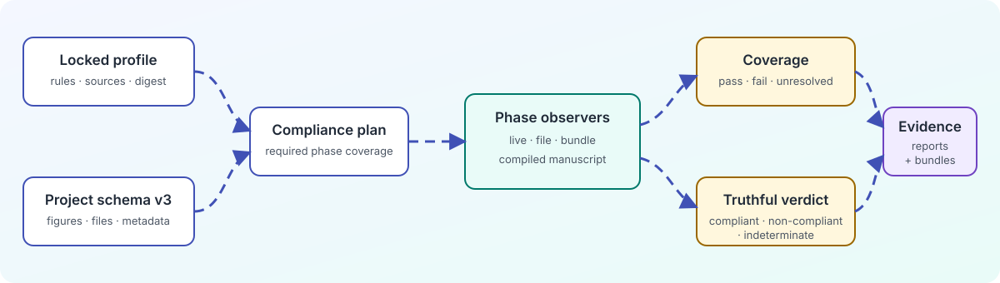
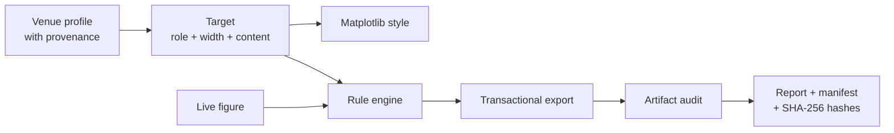

# ResearchPlot 1.0

ResearchPlot is an offline, source-backed compliance layer for Matplotlib figures and
their exported artifacts. It converts a versioned venue profile plus figure intent
into an exact style, a three-state compliance report, and—when requested—an audited
submission bundle.

!!! important "A compliance assistant"

    ResearchPlot cannot guarantee editorial acceptance. Venue instructions can change,
    journal-specific rules can override publisher guidance, and some requirements need
    human judgment. Reports expose sources, caveats, and unresolved checks so those
    limits remain visible.

<figure class="rp-architecture">
  
  <figcaption>Evidence flows from immutable venue rules to the artifact that is actually submitted.</figcaption>
</figure>



## Start in five minutes

```bash
python -m pip install researchplot-venues
```

```python
from pathlib import Path

import matplotlib.pyplot as plt
import researchplot as rp

target = rp.target(
    "nature@2026.08.0",
    role="main",
    width="single",
    content="line-art",
)

with target.style() as style:
    fig, ax = style.subplots(aspect=0.62)
    ax.plot([0, 1, 2, 3], [0, 1, 4, 9], marker="o")
    ax.set(xlabel="Input", ylabel="Response")
    result = target.export(fig, Path("submission") / "figure1.pdf")

print(result.report.verdict)
plt.close(fig)
```

[Follow the getting-started guide](getting-started.md){ .md-button .md-button--primary }
[Explore the architecture](architecture.md){ .md-button }

## Why use it?

### Reproducible venue resolution

Profiles use immutable coordinates such as `nature@2026.08.0`. Friendly aliases remain
convenient during exploration, but warn and report the coordinate they resolve to.

### Honest compliance reports

Required rules, recommendations, and inferred guidance are evaluated separately from
check outcomes. A required check that cannot be established makes the verdict
`INDETERMINATE`, never a silent pass.

### Verify the artifact, not just the plotting state

ResearchPlot audits PDF, SVG, PNG, JPEG, TIFF, and EPS output after export. Physical
size, fonts, format metadata, effective resolution, and accessible presentation are
checked where the file format exposes enough evidence.

### Submission provenance

A bundle manifest ties each exported file to its profile coordinate and digest, full
source metadata, target role, check results, manual attestations, descriptive text,
source data, and SHA-256 hash.

## Pick a workflow

| Goal | Start here |
| --- | --- |
| Create and export one figure | [Getting started](getting-started.md) |
| Understand pass/fail/unknown behavior | [Compliance reports](compliance.md) |
| Audit existing files in CI | [Project configuration](configuration.md) |
| Build a submission directory | [Export and bundles](bundles.md) |
| Inspect official sources and profile revisions | [Profiles and provenance](profiles.md) |
| Move from `rp.use()` and `report.passed` | [0.2 migration](migration.md) |
| Extend ResearchPlot | [Contributing](contributing.md) |

## Stable names

The PyPI distribution is `researchplot-venues`, while the import package and CLI are
both `researchplot`:

```text
pip install researchplot-venues
import researchplot
researchplot --help
```
