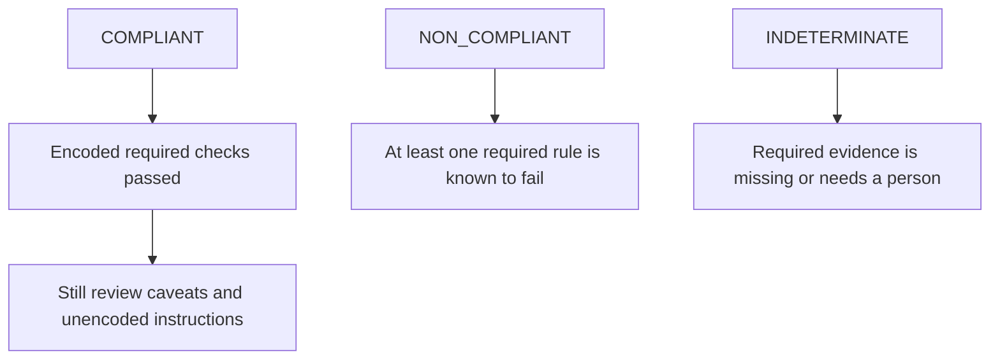

# Limitations and non-goals

ResearchPlot makes compliance evidence explicit; it does not make publication
requirements fully machine-decidable.

## Important limitations

### Venue instructions remain authoritative

Official guidance can change, special issues can add instructions, and an individual
journal can override a generic publisher profile. Always inspect profile sources and
caveats. A freshness warning is a prompt to re-check guidance, not proof it changed.

### A compliant report is bounded

`COMPLIANT` means every applicable **encoded required rule** was checked and passed with
the available inspectors. It does not mean every possible editorial preference was
encoded, the science is correct, or the venue will accept the artifact.

### File formats expose different evidence

A PDF can expose font resources, while a PNG usually cannot prove the font used before
rasterization. Metadata can be missing or inaccurate. ResearchPlot marks an unavailable
check skipped instead of treating metadata absence as a pass.

### Visual accessibility includes human judgment

Automated series-encoding and alt-text-presence checks catch some risks. ResearchPlot
1.0 does not provide a general color-vision simulator or automatic alt-text quality
assessment, and it cannot establish whether a complex panel layout is easy to
understand.

### External tools remain external

LaTeX is opt-in, and ResearchPlot does not install it. Font availability varies by
machine. Installed profile packs are discovered through Python entry points and execute
as trusted local code; install only packs you trust.

## Security model

Artifact parsing is non-executing and offline, but no parser should be treated as a
sandbox. Do not process untrusted files with privileges or filesystem access that the
caller does not need. SVG external references are reported rather than fetched.

Report suspicious parser behavior through the repository's private security process,
not a public issue.

## Explicit 1.0 non-goals

ResearchPlot 1.0 does not provide:

- generic high-level plotting wrappers;
- AI figure generation or AI-written alt text;
- publisher-template scraping or automatic online profile updates;
- Figma, Illustrator, Inkscape, or image-editor replacement;
- image manipulation, plagiarism, or research-integrity detection;
- scientific result validation;
- automatic submission to publisher systems;
- Plotly, R, Julia, or non-Matplotlib live backends.

Existing PDF/SVG/raster/EPS files can still be audited regardless of the tool that
created them.

## Legacy plotting helpers

The frozen `0.2` plotting wrappers are not part of the 1.0 core design. Projects that
still require them can install the `plots` extra during migration. New features and
venue profiles are not added to those wrappers; direct Matplotlib composition is the
supported path.

## How to interpret uncertainty

Do not coerce `INDETERMINATE` into `COMPLIANT` in CI. Add reliable evidence, record an
allowed manual attestation, or deliberately use a less strict policy while retaining
the unresolved finding.
