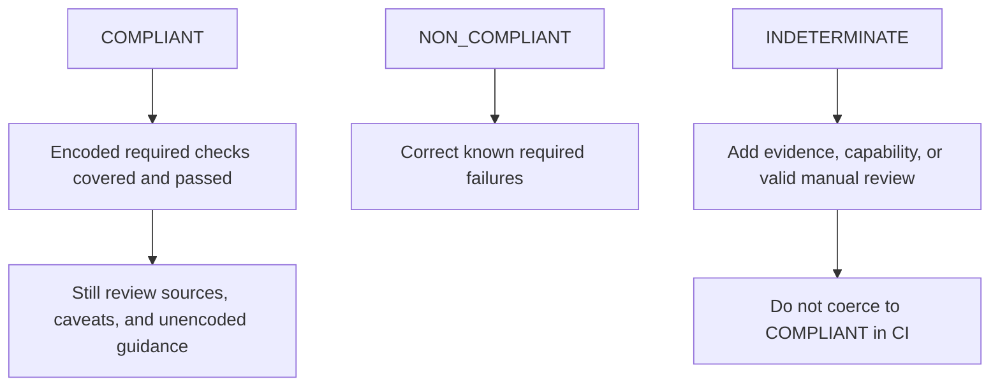

# Limitations, security, and non-goals

ResearchPlot makes evidence and uncertainty explicit; it does not make publication
requirements fully machine-decidable.

## Interpret `COMPLIANT` narrowly

`COMPLIANT` means every applicable **encoded required rule** in the selected immutable
profile has sufficient supported evidence and passes. It does not mean:

- every sentence in the current venue instructions has been encoded;
- the profile is fresher than the official page;
- a generic publisher rule applies unchanged to a specific journal;
- the figure is scientifically correct, ethical, accessible to every reader, or likely
  to be accepted.

Always inspect profile scope, sources, verification dates, status, and caveats.

## Evidence has phase and format limits

A saved raster cannot reveal original vector structure or font settings. A PDF may
expose font resources but not reconstruct every live artist. Metadata may be absent or
wrong. An unsupported property is skipped or becomes a capability gap; it is never
guessed.

The current normalized `CheckStatus` vocabulary is richer than the compatibility
`Report`, which still serializes `pass`, `fail`, and `skip`. Coverage-aware aggregation
maps those findings into the tri-state project verdict.

## Project and archive paths are confined

Schema-v3 references must be project-relative. Absolute paths, root/drive prefixes,
parent traversal, and resolved symlink/junction escapes are rejected. Bundle and
archive verification separately rejects traversal, absolute members, case collisions,
non-regular files, symlinks, and digest mismatch.

## Project bundle bridge is intentionally narrow

`Project.bundle()` writes a v1-compatible submission directory/manifest. It supports
one source-data file per figure and an existing preferred deliverable or live figure.
It rejects generic attachments and multiple source files. The public deterministic
archive writer supports ZIP and uncompressed TAR, honors `SOURCE_DATE_EPOCH`, and
normalizes vector-export metadata. Byte-for-byte reproducibility still assumes the same
ResearchPlot, Matplotlib, font, and backend environment.

## Manuscript placement is conservative

The compiled-PDF audit records page dimensions, resources, fonts, transparency,
annotations, and active content. It can associate a unique measurable image/Form
placement through an embedded provenance ID, exact decoded-raster fingerprint, or
configured page/number/caption hints, then measure bounds, rotation, source scale/DPI,
and crop-box clipping.

It does not canonicalize standalone vector artwork for exact fingerprinting,
distinguish caption text from an in-text reference, reconcile all manuscript
references/captions, or evaluate venue-specific placement rules. Even complete matching
therefore remains indeterminate at the project verdict level.

Native LaTeX and DOCX source parsing is not supported.

## Visual diagnostics are advisory

Color-vision and grayscale previews are deterministic screening aids. Visual
diagnostics measure global luminance range, entropy, extreme clipping fractions, and
transparency. Live Matplotlib diagnostics additionally measure rendered text/legend
bounds, text-bound overlap, whitespace, point-size legibility prompts, and sampled
colormap luminance behavior. They do not perform semantic object contrast, OCR,
color-only encoding, full perceptual-uniformity analysis, panel alignment, or human
legibility testing.

ResearchPlot does not generate alt text. Description quality and scientific meaning
require author and reviewer judgment.

## Registry deployment is opt-in

The TUF client requires the optional dependency plus an explicit repository URL,
trusted root, and cache. ResearchPlot does not ship a promise that a particular public
registry, root ceremony, or uptime is available. Normal operations remain offline.
Unsigned local profiles carry a different trust decision and should not be accepted in
frozen CI without deliberate allowlisting.

## Attestations and waivers are author evidence

The v3 project validates reviewer, date, rationale/evidence references for manual
attestations and profile digest, reviewer, reason, and expiry for waivers. ResearchPlot
does not authenticate a reviewer identity or cryptographically sign those statements.
Waivers do not alter the venue verdict.

## Parser and browser security

ResearchPlot reports active content and does not execute artifact scripts, actions, or
external SVG resources. Bounded subprocess inspection can limit time and workload, but
no PDF, image, XML, or archive parser should be treated as a perfect sandbox.

For untrusted files:

- run as a least-privileged user in a disposable environment;
- use isolated bounded inspection;
- enforce upstream upload limits;
- review active-content and parser warnings;
- never expose the local browser server through a reverse proxy.

The browser workspace refuses non-loopback binding, uses a per-launch token and origin
checks, limits request size, applies a content-security policy, and deletes temporary
uploads after inspection. It is not designed as a multi-user or hosted service.

## Explicit non-goals

ResearchPlot 2.0 does not provide:

- scientific-result validation, manipulation detection, plagiarism detection, or
  research-integrity analysis;
- automatic publisher submission or acceptance prediction;
- AI-generated figures, captions, alt text, or remediation;
- editing or lossless restyling of arbitrary raster artifacts;
- template scraping or background network updates;
- a hosted browser application or telemetry;
- native live adapters for Plotly, R, Julia, Figma, Illustrator, or Inkscape;
- native LaTeX/DOCX manuscript parsing;
- a replacement for Matplotlib, Seaborn, SciencePlots, TUEPlots, or PlotStyle.

Saved artifacts produced by any of those tools remain auditable when their format is
supported. Only styling and live-artist evidence are Matplotlib-specific.

## Respond to uncertainty

Report vulnerabilities privately using the process in
[`SECURITY.md`](https://github.com/Devrajsinh-Jhala/ResearchPlot/blob/main/SECURITY.md),
not a public issue.
