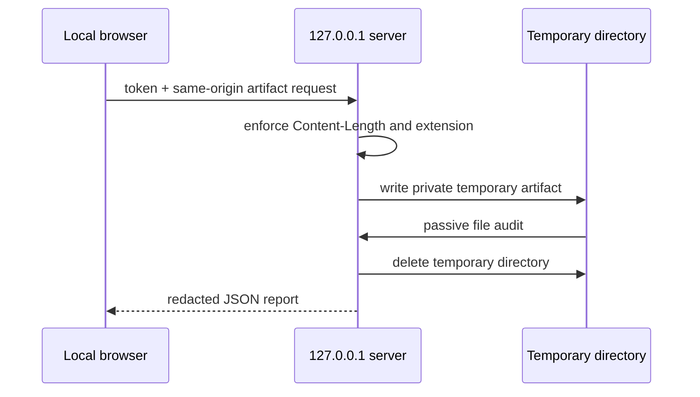

# Local preflight workspace

The optional browser workspace audits a saved figure on the same computer. It does not
upload the artifact to a hosted service.

```bash
python -m pip install "researchplot-venues[web]"
researchplot serve
```

Use `--port 8765` to request a port or `--no-browser` to print the URL without opening
it. The server always binds to `127.0.0.1`; remote binding is rejected.

## Current workflow

1. Select an installed immutable profile and named width.
2. Select role and content/artwork classification.
3. Drop a PDF, SVG, EPS, PNG, JPEG, or TIFF.
4. Review the phase-local verdict and individual findings.
5. For raster images, switch among original, grayscale, protanopia, deuteranopia, and
   tritanopia browser previews.
6. Download the JSON report or copy the equivalent `researchplot audit` command.

The workspace displays profile coordinate, verification date, caveat, widths, and
sources from the installed package. The server-side audit uses the same target and file
inspectors as the Python/CLI path.

## Privacy and request security



- A 32-byte random token is embedded in the launch URL and removed from visible browser
  history after startup.
- API requests require the token; write requests also require an allowed loopback
  origin.
- Static assets use a restrictive content-security policy.
- Uploads require `Content-Length` and are capped at 128 MiB.
- The original base filename is retained for display, but the temporary server path is
  removed from findings.
- Temporary files are deleted after each audit.
- There is no telemetry, account, remote API, or automatic profile update.

The browser itself receives the selected local file in order to POST it to loopback
and, for raster previews, draws it to a local canvas. It does not send it elsewhere.

## What is not in the workspace yet

The current interface is single-artifact and file-phase focused. It does not yet:

- create or edit a schema-v3 project;
- run batch project or manuscript checks;
- show aggregate phase coverage from `PlanAssessment`;
- render server-side PDF/SVG previews or diagnostic overlays;
- build bundles, JATS, RO-Crate, SARIF, or HTML reports;
- provide progress/cancellation for long batch inspections;
- persist reports or selected roots between launches.

Use the Python API or CLI for those implemented operations. A browser file audit can be
phase-limited even when it looks green; run a project check before submission.

## Do not host it

The loopback server is not designed for multi-user access, reverse proxies, shared
machines, or untrusted public uploads. A token and origin check reduce accidental local
access but do not turn a desktop process into a hardened hosted service. Use isolated
inspection and operating-system sandboxing when artifact trust is uncertain.
