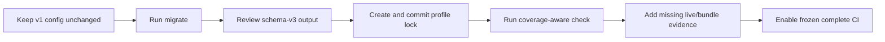

# Migrate to ResearchPlot 2.0

ResearchPlot 2.0 keeps the v1 workflow available throughout 2.x, but the primary model
is a strict schema-v3 project with explicit deliverables and phase coverage. No
compatibility surface is removed before 3.0.

## Recommended migration sequence



1. Upgrade in a branch and keep the original v1 config.
2. Run `researchplot migrate`; the default output is separate and does not overwrite
   the source.
3. Review generated figure IDs, profile coordinate, paths, content roles, captions,
   alt text, source data, and selected deliverables.
4. Add panels, long descriptions, data tables, attachments, manuscript data, and any
   manual evidence that v1 could not represent.
5. Create a profile lock and run a frozen check.
6. Treat new `INDETERMINATE` results as missing evidence, not regressions to suppress.

## Python migration bridge

```python
import researchplot as rp

legacy = rp.ProjectConfig.load("researchplot.toml")
spec = rp.project_spec_from_v1(legacy)
project = rp.Project(spec)
```

Or load directly through the compatibility bridge:

```python
project = rp.project_from_v1("researchplot.toml")
```

These functions warn that `ProjectConfig` is a 1.x model. They do not edit the source
file.

The translator preserves the profile coordinate, policy, artifact path/format, role,
width, content, caption, alt text, and one source-data path. It derives stable figure
IDs from filenames and creates one required/preferred deliverable per v1 figure.

It cannot infer panel structure, figure numbering, long descriptions, accessible data
tables, arbitrary attachments, manuscript matching hints, typed reviewer evidence,
waiver expiry, or intended companion files. Add those deliberately.

## API mapping

| v1-compatible call | v2 primary call | Reason |
| --- | --- | --- |
| `rp.target(profile, ...)` | `rp.Project.load(...).figure(id)` | Figure intent belongs to a project and deliverable graph. |
| `target.validate(fig)` | `figure.check(fig=fig)` | Adds configured file/bundle evidence and coverage. |
| `target.audit(path)` | `figure.check()` or CLI artifact audit | A project can disclose missing phases. |
| `target.export(fig, path)` | `figure.export(fig)` | Uses configured deliverables and export plan. |
| `ProjectConfig.load(path)` | `Project.load(path)` | Loads strict schema version 3. |
| `Submission(...)` | `project.bundle(directory)` | Uses project metadata; current implementation remains a v1 manifest bridge. |
| `Report` | `PlanAssessment` / `ValidationReport` | Adds coverage and capability gaps. |

The lower-level calls remain valid when a phase-local result is exactly what you want.

## Configuration mapping

### v1

```toml
profile = "nature@2026.08.0"
policy = "complete"

[[figures]]
path = "figures/figure1.pdf"
role = "main"
width = "single"
content = "line-art"
alt_text = "A line chart rising across four inputs."
source_data = "data/figure1.csv"
```

### v2 schema v3

```toml
schema_version = 3
profile = "nature@2026.08.0"
policy = "complete"
lock = "researchplot.lock.json"

[[figures]]
id = "figure-1"
role = "main"
width = "single"
content = "line-art"
alt_text = "A line chart rising across four inputs."
source_data = ["data/figure1.csv"]

[[figures.deliverables]]
id = "artifact"
format = "pdf"
path = "figures/figure1.pdf"
required = true
preferred = true
```

The profile must be exact. Figures and deliverables gain stable IDs. Source data becomes
a list, although the current `Project.bundle()` bridge still accepts only one source
file per figure.

## Verdict behavior

The most important breaking behavior is intentional: a passing file-phase report no
longer implies a compliant project.

```python
raw_file_report = figure.audit("figures/figure1.pdf")
coverage_report = figure.check()
```

The first answers what the file establishes. The second also asks whether every
required phase was covered. Automation must handle CLI exit code `3` separately from a
known venue violation (`1`) and invalid/unsafe input (`2`).

## Legacy plotting helpers

Install the optional bridge only while migrating:

```bash
python -m pip install "researchplot-venues[plots]"
```

Legacy functions are available lazily at the top level and from `researchplot.plots`.
They preserve their historical signatures and display behavior, return composable
Matplotlib/Seaborn objects, and emit deprecation warnings once per process. Missing
Seaborn, pandas, NumPy, SciPy, or scikit-learn dependencies produce a targeted install
message when the relevant helper is called.

```python
# Compatibility bridge
fig, ax = rp.line(x, y, "Time", "Accuracy", show=False)

# Preferred v2 authoring
with project.figure("figure-1").style() as style:
    fig, ax = style.subplots()
    ax.plot(x, y)
    ax.set(xlabel="Time", ylabel="Accuracy")
```

New compliance features are developed around native Matplotlib composition, not the
legacy plotting grammar.

## Manifest compatibility

Readers for v1 reports, export manifests, submission manifests, locks, and profile-v2
data remain available during 2.x. The current project bundle writer still uses the v1
submission manifest and rejects unrepresentable richer data. Do not assume every
schema-v3 field appears in that manifest.

Pin `researchplot-venues` in CI while migrating and retain both original and translated
configuration until the v2 report has been reviewed.
