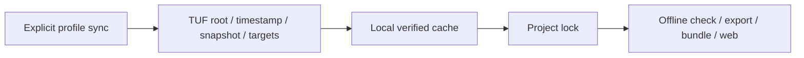

# Signed profile registry

Bundled profiles keep the base package usable offline. ResearchPlot 2.0 also includes
an opt-in The Update Framework (TUF) client for a separately operated signed registry.

## Install and configure trust explicitly

```bash
python -m pip install "researchplot-venues[registry]"

researchplot profile sync \
  --base-url https://profiles.example.org/ \
  --trusted-root keys/root.json \
  --cache-dir .researchplot/profiles \
  --coordinate nature@2026.08.0
```

`--base-url`, `--trusted-root`, and `--cache-dir` are required. The optional coordinate
must be pinned. The client validates trusted root, timestamp, snapshot, target metadata,
target bytes, profile schema, coordinate, and digest before returning a profile. Missing
TUF support or bad metadata is an operational error; there is no unsigned fallback.

The example URL is illustrative. A production public registry URL, root metadata, key
holders, threshold policy, rotation ceremony, publishing service, and availability are
deployment responsibilities and are not implied merely by installing the package.

## Network boundary



Normal profile list/search/show, planning, checking, audit, export, bundle, manuscript,
and browser operations do not contact the registry. Profile sync is the only intended
network operation.

## Inspect status and locks

```bash
researchplot profile status
researchplot profile status nature@2026.08.0 --json
researchplot profile lock nature@2026.08.0 --output researchplot.lock.json
researchplot profile verify \
  --lock researchplot.lock.json \
  --profile nature@2026.08.0
```

A lock captures the exact profile coordinate and digests used by a project. Frozen
planning fails before artifact inspection when the lock is missing or mismatched:

```bash
researchplot check --config researchplot.toml --frozen
```

Locks prevent silent profile movement inside a project. TUF separately protects signed
registry metadata against rollback/freeze attacks according to the repository's
metadata and client state.

## Trust states

Profile schema v3 models `draft`, `verified`, `deprecated`, and `withdrawn` status.
Status is evidence governance, not a claim that all venue requirements have been
encoded. Inspect sources and caveats even for verified profiles.

Unsigned local JSON can be loaded for authoring. It carries a separate trust decision
and should not be accepted in frozen CI without explicit allowlisting. Legacy
executable profile entry points are disabled by default because importing a plugin can
run code and shadow data.

## Python client

```python
client = rp.RegistryClient(
    "https://profiles.example.org/",
    trusted_root="keys/root.json",
    cache_dir=".researchplot/profiles",
)

print(client.diagnostic())
client.refresh()
profile = client.fetch_profile("nature@2026.08.0")
```

The client returns `RegistryDiagnostic` when capability is inspected and raises
`RegistryCapabilityError` when the optional dependency is unavailable. Callers remain
responsible for persisting an accepted profile pack and updating a project lock through
an explicit reviewed workflow.
