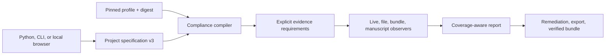
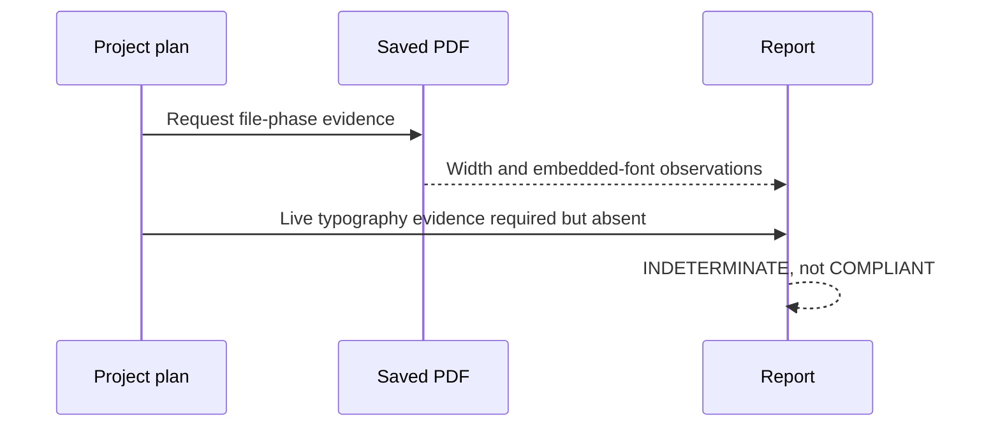

# ResearchPlot 2.0

ResearchPlot 2.0 changes the unit of work from a plotting helper or a single export to
a reproducible compliance plan for a complete figure project.



## The correctness contract

A project result is `COMPLIANT` only when every applicable encoded required rule has
sufficient evidence and passes. A known required violation is `NON_COMPLIANT`.
Missing required evidence, an unsupported probe, or a required human decision makes
the result `INDETERMINATE`.

This is stricter than a phase-local audit:



`PASS`, `FAIL`, and `SKIP` remain the low-level report outcomes used by the v1 bridge.
The v2 plan adds explicit phase coverage, capability gaps, and the aggregate verdict.
Rules outside the selected target are not applicable rather than failed.

## Strict project graph

A schema-v3 `ProjectSpec` describes intent separately from inspection:

- one exact profile coordinate and optional lock;
- one or more stable `FigureSpec` IDs;
- one or more concrete `DeliverableSpec` records per figure;
- optional number, caption, short alt text, long description, panels, source data,
  accessible data table, attachments, typed manual attestations, digest/expiry-bound
  waivers, and metadata;
- an optional compiled-PDF `ManuscriptSpec` with conservative matching hints.

Unknown keys, duplicate IDs or paths, unpinned profiles, empty figures, and invalid
formats are rejected. Referenced paths are project-relative; absolute paths, parent
traversal, and paths whose resolved target escapes the project root are rejected.

```python
import researchplot as rp

project = rp.Project.load("researchplot.toml")
executable = project.plan(frozen=True)  # verifies the configured lock immediately
report = executable.check()

if report.verdict is rp.Verdict.COMPLIANT:
    result = project.bundle("dist/submission")
```

The current `Project.bundle()` writes a staged submission directory using the v1
manifest bridge. Existing-file projects must provide one preferred deliverable per
logical figure; generic attachments and multiple source-data files are rejected rather
than silently lost. Deterministic ZIP verification, JATS, and RO-Crate converters are
separate public APIs while the richer bundle manifest is completed.

## Figure-level authoring

```python
figure = project.figure("figure-1")

with figure.style(deliverable="main") as style:
    fig, ax = style.subplots(aspect=0.62)
    ax.plot(x, y)
    report = figure.check(fig=fig)
    export = figure.export(fig, policy="violations")
```

`figure.check(fig=...)` combines the supplied live figure with configured bundle
metadata and existing deliverable files, then evaluates coverage for that logical
figure. `figure.validate(fig)` and `figure.audit(path)` remain available when a raw
phase-local `Report` is intentionally wanted.

## Declarative profile engine

Profile schema v3 adds:

- immutable coordinate, revision, status, governance, review, and digest metadata;
- typed probe definitions and unit-safe quantities;
- comparison, membership, existence, bounded pattern, composition, collection
  quantifier, and count/minimum/maximum aggregate expression data without executable
  Python;
- rule applicability across role, content, format, and evidence phase;
- source fingerprints, retrieval/verification dates, locators, interpretations, and
  revision history;
- deterministic publisher-base/profile composition with conflict detection.

Bundled schema-v2 profiles translate into the v3 model during the compatibility
period. Third-party executable entry points are disabled by default; a local profile
is data, not imported code.

## Offline profile registry

Bundled profiles make every base installation useful offline. The optional registry
client uses The Update Framework (TUF) with an explicitly supplied trusted root and a
content-addressed cache. Synchronization is opt-in; checking and exporting never fetch
updates. A frozen plan checks the exact coordinate and digest in the project lock
before inspecting any artifact.

The library provides the signed-registry client and diagnostics. Public production
registry metadata and key-rotation operations remain deployment responsibilities; an
unconfigured client fails closed rather than falling back to unsigned data.

## Deep artifact inspection

The v2 inspectors collect more evidence without executing embedded content:

- PDF page boxes, font resources, image objects, color spaces, transparency,
  annotations, JavaScript/actions, and embedded files;
- SVG dimensions, fonts/text, external references, scripts, handlers, `foreignObject`,
  and embedded payloads;
- raster EXIF orientation, dimensions, DPI, color mode, ICC profile, bit depth,
  compression, alpha, and frame count;
- EPS bounding boxes and format integrity.

Bounded isolated inspection exposes per-file and batch budgets. Timeouts, crashes, and
resource-limit breaches are operational failures, not partial success. Deterministic
archive verification rejects traversal, absolute paths, case collisions, symlinks,
digest mismatch, missing files, and unexpected files.

## Deterministic visual QA

`render_accessibility_previews()` produces original, grayscale, protanopia,
deuteranopia, and tritanopia PNG previews. `diagnose_visual()` adds advisory signals for
global luminance range, entropy, extreme clipping, and transparency. For a live
Matplotlib figure it also measures text/legend clipping, visible-text bounding-box
overlap, axes/canvas whitespace, a final-size font prompt, and sampled colormap
luminance monotonicity/uniformity. Every heuristic includes confidence and limitations;
none is silently promoted to a venue rule or used to generate alt text.

Semantic graphical-object contrast, color-only encoding, panel alignment, OCR, and
full perceptual-uniformity analysis remain areas for future conformance work. Use the
preview as evidence for human review, not as a scientific interpretation.

## Compiled manuscript PDF

`Project.audit_manuscript()` audits page geometry, fonts, resources, transparency,
annotations, and active-content indicators. It then matches configured figures in
evidence order: embedded provenance ID, exact decoded-raster fingerprint, then a unique
object on pages selected by configured number/caption hints. Resolved placements expose
bounds, dimensions, rotation, effective DPI, crop-box clipping, and source scaling.

Ambiguous, repeated, missing, or unmeasured candidates remain unresolved. Standalone
vector fingerprinting, caption/reference reconciliation, rendered fallback, and
venue-specific manuscript rule evaluation are not implemented. A required manuscript
therefore still adds a visible aggregate capability gap instead of claiming compliance
from placement coverage alone.

Native LaTeX and DOCX source parsing are outside the v2 scope.

## Reports and interoperability

`PlanAssessment.to_dict()` emits report schema version 2 data with profile identity,
plan digest, summary, source records, findings, remediations, coverage, capability gaps,
privacy-safe environment provenance, and the phase reports that produced it. Terminal,
JSON, SARIF, and self-contained HTML renderers
preserve the underlying verdict. SARIF is intended for workspace-relative automation;
HTML contains no external scripts or assets.

Saved-file auditing is backend-neutral. Only styling and live-artist inspection depend
on Matplotlib.

## Compatibility through 2.x

The following remain available throughout 2.x:

- `Target`, `target()`, the v1 `Report`, current v1 project/manifest readers, and CLI
  aliases;
- `researchplot.plots` and lazy top-level plotting names when `[plots]` is installed;
- schema-v2 profile translation and legacy locks needed for migration.

Compatibility entry points emit deprecation warnings once per process. They will not be
removed before 3.0. New writes use v2/v3 contracts where those writers are available;
the staged submission-directory bridge still writes its v1 manifest and documents that
limitation.

## Security and privacy

The optional browser workspace listens only on loopback, requires a per-launch token,
checks origins, applies a restrictive content-security policy, bounds upload size, and
deletes temporary artifacts after inspection. It has no telemetry or remote upload.

No file parser is a perfect sandbox. Use isolated inspection with least privilege for
untrusted files, review active-content findings, and consult the
[security limitations](limitations.md) before incorporating the tool into a public
upload service.
